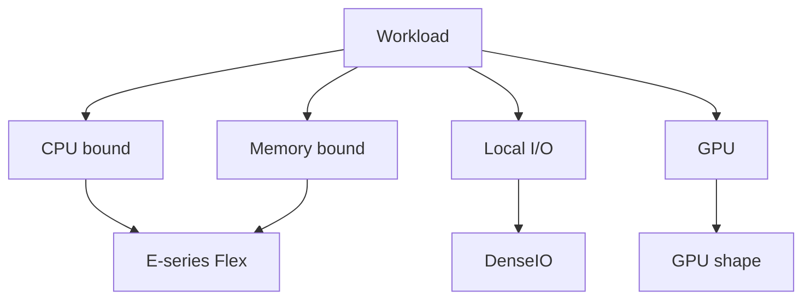

import { ConceptTemplate } from '@/features/kb/components/templates/ConceptTemplate'
import { Callout } from '@/features/kb/components/mdx/Callout'
import { ComparisonTable } from '@/features/kb/components/mdx/ComparisonTable'

export default function Layout({ children }) {
  return (
    <ConceptTemplate title="OCI Compute Shapes">
      {children}
    </ConceptTemplate>
  )
}

A **shape** is the OCI machine type. **Flex** shapes let you pick OCPU count and memory within a ratio band. Fixed shapes (dense I/O, GPU, HPC) lock the bill of materials. Series letters (E for AMD, A for Ampere, X for x86 Intel, GPU lines) tell you the CPU vendor.

## 1. Deep Dive and Mechanics

**OCPU.** On x86, an OCPU is typically a physical core (two hyperthreads). On Ampere, the mapping is one-to-one with a core. Do not compare "2 vCPU" across clouds without reading the definition.

**Flex.** `VM.Standard.E5.Flex` with 2 OCPU / 16 GB is a common default. Memory-per-OCPU has min and max. Databases that need 128 GB and 2 cores are a Flex story, not a bigger fixed shape.

**Specials.** DenseIO attaches local NVMe. GPU shapes expose NVIDIA (or other) devices. Bare metal shapes are whole servers. Standard vs Optimized vs HPC networking differs.

**Availability.** Not every shape exists in every AD or region. List shapes via API before you write Terraform that only works in Phoenix.

<Callout icon="warning" title="Local NVMe is not a backup">
DenseIO disks die with the instance (or the host). Persist to block volumes or Object Storage. NVMe is a cache or a scratch.
</Callout>

## 2. Mathematical / Theoretical Foundation

Price ≈ OCPU-hours + memory-hours + GPU-hours + license adders. Windows and Oracle images change the equation.

Network bandwidth often scales with OCPU on Flex. A 1-OCPU instance may be the bottleneck, not the disk.

<ComparisonTable
  headers={['Family', 'CPU', 'When']}
  rows={[
    ['E-series Flex', 'AMD', 'Default general'],
    ['A-series', 'Ampere Arm', 'Scale-out, price'],
    ['DenseIO', 'Local NVMe', 'Scratch / some DB'],
    ['GPU / BM', 'Accelerators / whole box', 'ML, RAC, VMware'],
  ]}
/>

## 3. Real-World Implementation

```bash
oci compute shape list --compartment-id $COMP --output table

# Terraform shape_config
# shape = VM.Standard.E5.Flex
# ocpus = 4
# memory_in_gbs = 32
```

Pin the series (E5 vs E4) so a silent family change does not reshape prod.

## 4. Visualizations



## 5. Interview Prep

**Q: What is an OCPU?**
**A:** Oracle's core unit. On Intel/AMD VMs it maps to a physical core. Always read the current docs when comparing to AWS vCPU.

**Q: Flex vs fixed?**
**A:** Flex for custom CPU/RAM. Fixed when the SKU includes local disks, GPUs, or a certified BOM.

**Q: Why did launch fail with shape not found?**
**A:** Wrong AD, region, or capacity. Shapes are not global SKUs.

## 6. Production Use Cases

- Rightsize a Java heap by raising RAM without doubling cores.
- Ampere fleets for container nodes that are compiled for arm64.
- Reserved GPU shapes for a training queue.

<Callout icon="tip" title="Measure, then Flex">
Start from p95 CPU and RSS, not from the last AWS instance you copied. Flex exists so you stop buying 8 cores for 7 GB of Java.
</Callout>
