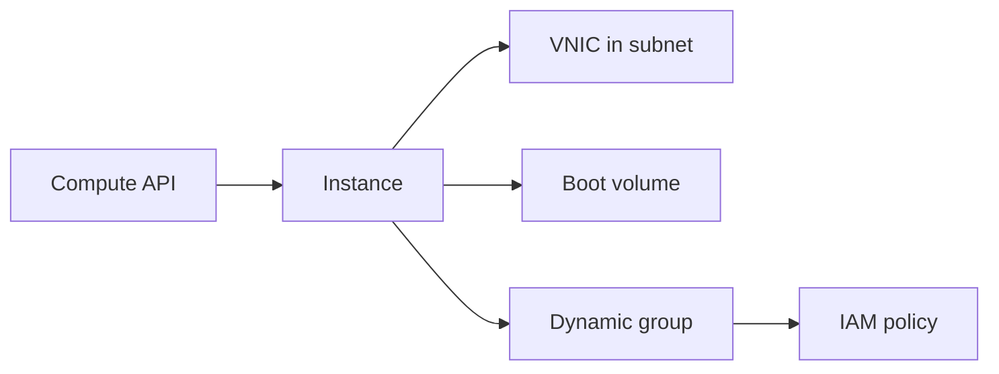

import { ConceptTemplate } from '@/features/kb/components/templates/ConceptTemplate'
import { Callout } from '@/features/kb/components/mdx/Callout'
import { ComparisonTable } from '@/features/kb/components/mdx/ComparisonTable'

export default function Layout({ children }) {
  return (
    <ConceptTemplate title="OCI Compute">
      {children}
    </ConceptTemplate>
  )
}

**OCI Compute** is VMs and **bare metal** instances. Virtualization of network and storage is largely **off-box** (SmartNIC), so a VM is not sharing a traditional hypervisor tax on the same cores you bought. You pick a **shape**, an **image**, a subnet, and optionally an instance profile for IAM.

## 1. Deep Dive and Mechanics

**Launch.** Compartment, AD, shape (fixed or Flex OCPU/RAM), image, VNIC, SSH keys or cloud-init. Secondary VNICs exist for multi-homed designs.

**Bare metal.** No tenant hypervisor on the host CPU. Used for RAC, dense I/O, and VMware. You still do not own the SmartNIC.

**Lifecycle.** Stop vs terminate. Stop keeps the boot volume; terminate can delete it. Instance pools and autoscaling wrap the same API.

**Identity.** Instance principals via dynamic groups beat embedding user keys. The metadata service is the credential path.

<Callout icon="warning" title="Public IP is a choice">
A VNIC can have a public IP. Defaulting to public for SSH is how tenancies get scanned. Use bastion, VPN, or Instance Console Connections.
</Callout>

## 2. Mathematical / Theoretical Foundation

Flex shapes: you pay for OCPU and memory you selected. Over-allocating RAM you never touch is a linear bill.

Capacity: shapes are regional/AD stock. Burst launches of GPU or dense I/O fail without a reservation.

<ComparisonTable
  headers={['Offer', 'Isolation', 'Typical use']}
  rows={[
    ['VM Flex', 'Shared host', 'General apps'],
    ['Bare metal', 'Whole server', 'RAC, VMware, HPC'],
    ['Dedicated VM host', 'You own the host', 'License / isolation'],
    ['Container Instances', 'Managed containers', 'No kube required'],
  ]}
/>

## 3. Real-World Implementation

```bash
oci compute instance launch \
  --compartment-id $COMP \
  --availability-domain "$AD" \
  --shape VM.Standard.E5.Flex \
  --shape-config '{"ocpus":2,"memoryInGBs":16}' \
  --image-id $IMAGE \
  --subnet-id $SUBNET \
  --assign-public-ip false
```

Attach a dynamic group and a policy so the instance can write logs without a user key.

## 4. Visualizations



## 5. Interview Prep

**Q: What is off-box virtualization?**
**A:** Network and storage virt sit on a SmartNIC, not on the host CPU you rented. That is OCI's pitch for near-bare-metal VM performance.

**Q: VM vs bare metal?**
**A:** VM for elasticity and density. Bare metal when you need the whole box or a license that forbids a hypervisor.

**Q: How does the instance call Object Storage?**
**A:** Instance principal: dynamic group match on compartment/shape, policy allow. No access-key file.

## 6. Production Use Cases

- Autoscaled web pools behind a load balancer.
- Bare metal for Oracle RAC or VMware HCX landing.
- GPU shapes for training with reservations.

<Callout icon="tip" title="cloud-init is the image contract">
Bake SSH hardening and agents into the image; pass only instance-specific config at launch. Snowflakes start with one-off yum in the console.
</Callout>
