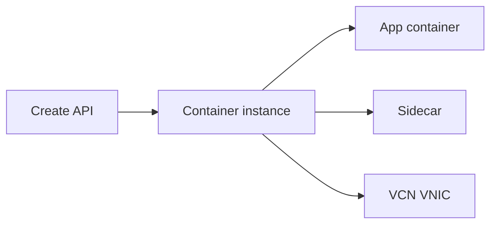

import { ConceptTemplate } from '@/features/kb/components/templates/ConceptTemplate'
import { Callout } from '@/features/kb/components/mdx/Callout'
import { ComparisonTable } from '@/features/kb/components/mdx/ComparisonTable'

export default function Layout({ children }) {
  return (
    <ConceptTemplate title="OCI Container Instances">
      {children}
    </ConceptTemplate>
  )
}

**Container Instances** run one or more containers on Oracle-managed compute without you creating a Kubernetes cluster. You pick CPU/memory, an image from OCIR or a public registry, a VCN subnet, and optional volumes. It is the OCI analog of Azure Container Instances or Cloud Run Jobs (process-shaped), not a scheduler for 200 microservices.

## 1. Deep Dive and Mechanics

**Shape.** You buy a container-instance size (OCPU/RAM). Multiple containers in one instance share that box (sidecar pattern) like a pod, but there is no kubelet API.

**Networking.** A VNIC lands in your subnet. NSGs apply. Public IP is optional. This is why it feels closer to a VM than to a Function.

**Lifecycle.** Create, start, stop, delete. Restart policy for the container process. No Deployment rolling update object — you replace the instance or rebuild.

**Images.** OCIR with IAM is the prod path. Pull secrets for external registries. Image mutability (`latest`) is the same footgun as everywhere.

<Callout icon="warning" title="This is not a cluster">
No Service object, no HPA, no DaemonSet. If you need those, use OKE. If you need a 200 ms webhook and scale to zero, look at Functions.
</Callout>

## 2. Mathematical / Theoretical Foundation

You pay while the instance exists, similar to a VM, not per-request. Idle container instances are idle VMs with extra steps.

Startup time includes image pull. Large images on a cold host dominate. Cache behavior is not your kubelet disk.

<ComparisonTable
  headers={['Run where', 'Orchestration', 'Bill']}
  rows={[
    ['Container Instances', 'None', 'Instance time'],
    ['OKE', 'Kubernetes', 'Nodes + control'],
    ['Functions', 'Events', 'Invocations'],
    ['Compute VM + Docker', 'You', 'VM time'],
  ]}
/>

## 3. Real-World Implementation

```bash
oci container-instances container-instance create \
  --compartment-id $COMP \
  --availability-domain "$AD" \
  --shape CI.Standard.E4.Flex \
  --shape-config '{"ocpus":1,"memoryInGBs":8}' \
  --vnics '[{"subnetId":"'"$SUBNET"'"}]' \
  --containers '[{"imageUrl":"iad.ocir.io/ns/api:1.4"}]'
```

Pin the digest in prod. Tag `1.4` should still be immutable in your registry policy.

## 4. Visualizations



## 5. Interview Prep

**Q: Container Instances vs OKE?**
**A:** Use instances for a handful of long-running containers without kube tax. Use OKE when you need Kubernetes API, many teams, or complex rollout.

**Q: vs Functions?**
**A:** Functions are event-billed and time-capped. Container Instances are processes you leave up.

**Q: How do they get IAM?**
**A:** Resource principals / dynamic groups, same family as compute instance principals.

## 6. Production Use Cases

- A vendor container you refuse to wrap in a full cluster.
- Sidecar-plus-app for a small internal tool.
- CI runner boxes that should die after the job, created by automation.

<Callout icon="tip" title="Put images in OCIR">
Public Docker Hub rate limits will page you. Mirror to OCIR and pull privately over the VCN.
</Callout>
