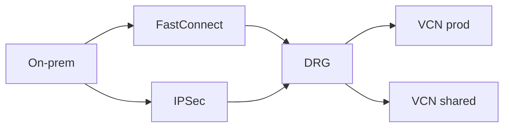

import { ConceptTemplate } from '@/features/kb/components/templates/ConceptTemplate'
import { Callout } from '@/features/kb/components/mdx/Callout'
import { ComparisonTable } from '@/features/kb/components/mdx/ComparisonTable'

export default function Layout({ children }) {
  return (
    <ConceptTemplate title="OCI Dynamic Routing Gateway">
      {children}
    </ConceptTemplate>
  )
}

A **Dynamic Routing Gateway (DRG)** is a virtual router you attach to VCNs, IPSec tunnels, FastConnect virtual circuits, and remote peering connections. Version 2 DRGs have route tables per attachment. It is the OCI hub-and-spoke primitive, closer to AWS Transit Gateway than to a lone Internet Gateway.

## 1. Deep Dive and Mechanics

**Attachments.** Each spoke VCN, each FastConnect, each IPSec, and RPC gets an attachment. Traffic between attachments only flows if DRG route tables say so.

**Route tables.** Import distributions pull routes from an attachment type; export distributions push routes back. This is how you prevent spoke-to-spoke by default or enable it on purpose.

**ECMP.** Equal-cost paths over multiple FastConnect or IPSec attachments increase bandwidth and add failover. Asymmetric routing will break stateful on-prem firewalls if you do not plan return paths.

**Tenancy.** A DRG can attach VCNs from other compartments or, with the right IAM, other tenancies. Landing-zone network accounts own the DRG.

<Callout icon="warning" title="Default deny between spokes">
A new DRG does not automatically mesh all VCNs. That is a feature. Explicit import/export is how you avoid a flat company-wide L3 domain.
</Callout>

## 2. Mathematical / Theoretical Foundation

Routing is longest-prefix match plus ECMP hash. Two equal defaults via VPN and FastConnect will split flows. Pin priorities when you want FastConnect primary and IPSec backup.

MTU: FastConnect and IPSec have different effective MTUs. Black holes look like "some sites work." Clamp MSS.

<ComparisonTable
  headers={['Hub', 'Cloud', 'Typical spokes']}
  rows={[
    ['DRG v2', 'OCI', 'VCN, FastConnect, IPSec, RPC'],
    ['Transit Gateway', 'AWS', 'VPC, DX, VPN'],
    ['Azure Route Server / vWAN', 'Azure', 'VNets, ExpressRoute'],
    ['Cloud Router / NCC', 'GCP', 'VPC, Interconnect, VPN'],
  ]}
/>

## 3. Real-World Implementation

```bash
oci network drg create --compartment-id $NET --display-name hub
oci network drg-attachment create --drg-id $DRG --vcn-id $VCN
# Then attach FastConnect / IPSec and set import route distributions
```

Document the intended matrix: which VCNs talk, which only reach on-prem. Terraform the distributions.

## 4. Visualizations



## 5. Interview Prep

**Q: IGW vs DRG vs LPG?**
**A:** IGW is internet. LPG is one-to-one VCN peer (local). DRG is the many-attachment router for hybrid and hub-spoke.

**Q: Why DRG v2?**
**A:** Per-attachment route tables and import/export. Classic DRG was a simpler stub. New designs should be v2.

**Q: How do two regions connect?**
**A:** Remote peering on DRGs, plus routes. This is not automatic.

## 6. Production Use Cases

- Hub VCN for inspection, spokes for apps, on-prem via FastConnect.
- Dual-homed backup VPN with ECMP or priority.
- Shared services VCN reachable from many workload VCNs.

<Callout icon="tip" title="Draw the route tables first">
If you cannot sketch who learns 10.0.0.0/8, do not click Create. DRG incidents are almost always an import you forgot.
</Callout>
