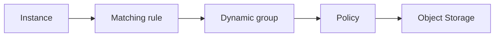

import { ConceptTemplate } from '@/features/kb/components/templates/ConceptTemplate'
import { Callout } from '@/features/kb/components/mdx/Callout'
import { ComparisonTable } from '@/features/kb/components/mdx/ComparisonTable'

export default function Layout({ children }) {
  return (
    <ConceptTemplate title="OCI Dynamic Groups">
      {children}
    </ConceptTemplate>
  )
}

A **dynamic group** is an IAM principal whose members are resources that match a rule (compartment, tag, instance OCID, resource type). Policies then `allow dynamic-group X to ...`. Instances, Functions, and other resource principals use this instead of embedding a user key.

## 1. Deep Dive and Mechanics

**Matching rules.** Examples: all instances in compartment `prod`, instances with tag `role=api`, a specific OCID. Rules are OR/AND expressions. A newly launched instance that matches becomes a member without a second API call.

**Instance principals.** The guest talks to the metadata/identity service and receives short-lived tokens. SDKs with Instance Principals Authentication do this for you.

**Resource principals.** Functions and some other services use a similar token path. One dynamic group can mix types if the rule language allows.

**Blast radius.** `All instances in tenancy` plus `manage all-resources` is a self-own. Match the smallest compartment and tag.

<Callout icon="error" title="User keys on compute">
If you find `~/.oci/config` on a VM with a human user OCID, rotate it and switch to a dynamic group. That key survives instance replace and git leaks.
</Callout>

## 2. Mathematical / Theoretical Foundation

Membership is a predicate evaluated on resource attributes. Tags become part of the authorization program. Untagged instances fall out — or, worse, a loose rule includes them.

Token lifetime is short. Compromise of a single instance is still bad (the roles it has) but is not a long-lived user key in a wiki.

<ComparisonTable
  headers={['Identity', 'OCI', 'AWS analog']}
  rows={[
    ['Compute role', 'Dynamic group + policy', 'Instance profile + role'],
    ['Function role', 'Resource principal', 'Lambda execution role'],
    ['Human', 'User / group / IdP', 'IAM user / SSO'],
    ['Key file', 'Avoid', 'Avoid access keys'],
  ]}
/>

## 3. Real-World Implementation

```text
All {instance in compartment 'prod'}

allow dynamic-group api-instances to read objects in compartment prod
where target.bucket.name = 'api-config'
```

Pair with a matching rule that is compartment-tight. The `where` clause is extra defense.

## 4. Visualizations



## 5. Interview Prep

**Q: Dynamic group vs IAM group?**
**A:** IAM groups hold users. Dynamic groups hold matching resources. Do not put people in dynamic groups.

**Q: How does the SDK authenticate?**
**A:** Instance principals provider. No config file. The signer fetches a cert from the metadata service.

**Q: Can I match on tags?**
**A:** Yes, and you should, so a sandbox VM in the same compartment does not inherit prod roles.

## 6. Production Use Cases

- App VMs that write logs and read a config bucket.
- OKE nodes or Functions that call Vault.
- Backup instances allowed only to create volume backups.

<Callout icon="tip" title="One dynamic group per role, not per instance">
OCID lists do not scale. Compartment plus tag is the production rule shape.
</Callout>
