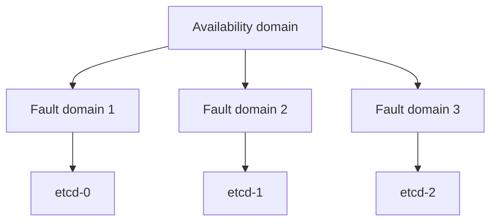

import { ConceptTemplate } from '@/features/kb/components/templates/ConceptTemplate'
import { Callout } from '@/features/kb/components/mdx/Callout'
import { ComparisonTable } from '@/features/kb/components/mdx/ComparisonTable'

export default function Layout({ children }) {
  return (
    <ConceptTemplate title="OCI Fault Domains">
      {children}
    </ConceptTemplate>
  )
}

A **fault domain (FD)** is a grouping of hardware and infrastructure inside a single **availability domain**. Each AD has three FDs. Placing replicas in different FDs reduces correlated failure from a rack, switch, or power distribution unit. It does not survive loss of the AD or region.

## 1. Deep Dive and Mechanics

**Placement.** You can specify FD at instance launch. If you omit it, OCI spreads best-effort. For quorum systems, specify FD-1, FD-2, FD-3 explicitly.

**What it covers.** Compute and some associated resources. It is not a full second copy of every regional service. Block volumes stay in the AD; FD does not teleport disks.

**Maintenance.** Oracle uses FDs to roll host maintenance so not all of your specified spread dies at once — if you actually spread.

**Single-AD regions.** FD is the only in-region physical spread you have. DR still wants another region.

<Callout icon="warning" title="Three FDs is not three ADs">
A building flood takes all three FDs. Interviews that treat FD as AZ-equivalent are wrong. AZ analog is AD; FD is extra anti-affinity.
</Callout>

## 2. Mathematical / Theoretical Foundation

Quorum of 3: one FD down should leave 2/3. If the scheduler stacked two etcd members in FD-1, you have a paper quorum.

Capacity: an FD can be tight on a shape. Launch fail in FD-3 while FD-1 has stock. Placement is a constraint satisfaction problem.

<ComparisonTable
  headers={['Spread', 'Survives', 'Does not']}
  rows={[
    ['Different FD', 'Rack / PDU event', 'AD loss'],
    ['Different AD', 'DC loss', 'Region loss'],
    ['Different region', 'Region event', 'Bad global config'],
    ['Same host anti-colocate', 'Single hypervisor', 'Almost nothing else'],
  ]}
/>

## 3. Real-World Implementation

```hcl
resource "oci_core_instance" "etcd" {
  count               = 3
  fault_domain        = "FAULT-DOMAIN-${count.index + 1}"
  availability_domain = var.ad
  # ...
}
```

Verify with `oci compute instance list` that FD is what you intended after apply.

## 4. Visualizations



## 5. Interview Prep

**Q: Fault domain vs AD?**
**A:** AD is a data center isolation domain. FD is a rack-level grouping inside that AD. Use AD first when the region has several; always use FD for in-AD spread.

**Q: Does Object Storage have FDs?**
**A:** Regional services have their own durability story. You do not place a bucket in FD-2.

**Q: Should every VM set FD?**
**A:** Stateful quorum: yes. Large stateless pools: spread or let the platform, but still multi-AD if available.

## 6. Production Use Cases

- Three-node databases and consensus clusters.
- Primary/secondary pairs forced apart inside a 1-AD region.
- Rolling maintenance with at least one replica always in another FD.

<Callout icon="tip" title="Alert if members collapse into one FD">
Autoscaling and replace can undo your spread. A config check on FD diversity is cheaper than a quorum outage.
</Callout>
