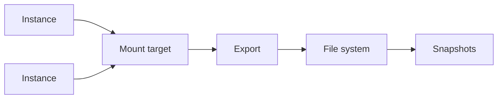

import { ConceptTemplate } from '@/features/kb/components/templates/ConceptTemplate'
import { Callout } from '@/features/kb/components/mdx/Callout'
import { ComparisonTable } from '@/features/kb/components/mdx/ComparisonTable'

export default function Layout({ children }) {
  return (
    <ConceptTemplate title="OCI File Storage">
      {children}
    </ConceptTemplate>
  )
}

**File Storage Service (FSS)** is a managed NFSv3 filesystem. You create a **file system**, an **export** (path + options), and a **mount target** (IP in a subnet). Instances mount that IP. Snapshots are cheap and in-place. It is EFS/Azure Files/Filestore class, not Object Storage.

## 1. Deep Dive and Mechanics

**Mount targets.** A VNIC in your VCN. NSGs or security lists must allow NFS ports from clients. One mount target can export many file systems. Availability is tied to the AD of the mount target unless you use replication patterns.

**Exports.** `exportOptions` lock which CIDRs can mount and whether root squash applies. Wide 0.0.0.0/0 exports in a flat VCN are a file share for everyone.

**Snapshots and clone.** Snapshots are read-only views. Clone a snapshot to a new file system for refresh. Replication to another AD/region is the DR feature — enable it before you need it.

**Performance.** Throughput and IOPS scale with size and offering (standard vs high-performance SKUs). Metadata-heavy workloads (millions of tiny files) behave worse than large sequential reads.

<Callout icon="warning" title="NFS lock and UID">
UID/GID on the server are numbers, not your Linux username. Two images with different UIDs will "lose" permissions. Align images or use squash carefully.
</Callout>

## 2. Mathematical / Theoretical Foundation

NFS is stateful enough that a hard mount plus a dead mount target hangs processes. Soft mounts fail I/O. Pick based on whether hung hosts or EIO is worse.

Cost is capacity (and sometimes performance units). Snapshot space is incremental but not free if you never expire them.

<ComparisonTable
  headers={['Service', 'Protocol', 'Good for']}
  rows={[
    ['OCI File Storage', 'NFSv3', 'Lift-and-shift shares'],
    ['EFS', 'NFSv4', 'AWS shared POSIX'],
    ['Azure Files', 'SMB / NFS', 'Windows + Linux'],
    ['Object Storage', 'HTTPS API', 'Blobs, not home dirs'],
  ]}
/>

## 3. Real-World Implementation

```bash
sudo yum install -y nfs-utils
sudo mkdir -p /mnt/share
sudo mount -t nfs -o nfsvers=3,noatime 10.0.2.4:/export/share /mnt/share
```

Put the mount in fstab with `_netdev` so it waits for the VNIC.

## 4. Visualizations



## 5. Interview Prep

**Q: File Storage vs Block Volume vs Object?**
**A:** Block is a disk for one instance (or clustered SCSI). File is concurrent POSIX. Object is an API, not a filesystem.

**Q: How do you lock down exports?**
**A:** exportOptions source CIDR plus NSG on the mount target. Both. One without the other is a hole.

**Q: Can OKE use it?**
**A:** Yes, via a CSI/NFS provisioner. Watch GID and storage class reclaim.

## 6. Production Use Cases

- Shared app config or batch drop-boxes for a lift-and-shift.
- Home directories for a small Linux fleet (with snapshots).
- Cross-instance working set for HPC-ish jobs that are not ready for object APIs.

<Callout icon="tip" title="Test failover of the mount target AD">
A single mount target in one AD is a SPOF for the share. Know the replication/DR story before you put the only copy of critical files there.
</Callout>
