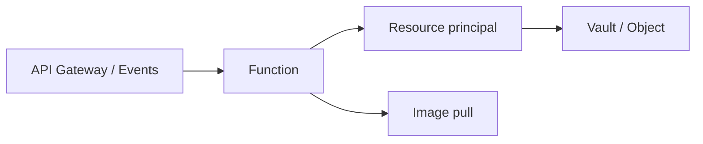

import { ConceptTemplate } from '@/features/kb/components/templates/ConceptTemplate'
import { Callout } from '@/features/kb/components/mdx/Callout'
import { ComparisonTable } from '@/features/kb/components/mdx/ComparisonTable'

export default function Layout({ children }) {
  return (
    <ConceptTemplate title="OCI Functions">
      {children}
    </ConceptTemplate>
  )
}

**OCI Functions** is a managed FaaS built on the **Fn Project**. You deploy a container image into an **application** (which sits on a VCN subnet). Invocations come from the CLI, signed HTTP, API Gateway, or Events. Memory and timeout are the knobs. Cold starts include image pull.

## 1. Deep Dive and Mechanics

**App + function.** An application is the network and IAM boundary (subnet, config). Functions inside share that VCN path. Config vars are per app or per function.

**Images.** You build with Fn or Docker and push to OCIR. The platform pulls on a cold worker. Fat images are slow.

**Auth.** Resource principals let the function call OCI APIs. Invoke is IAM-controlled; a public Function without a gateway is rarely what you want.

**Concurrency.** One request per instance is the mental model unless you opted into features that change it. A chatty downstream will serialize.

<Callout icon="warning" title="Subnet and NAT">
A function in a private subnet needs a NAT or service gateway to reach public APIs and OCIR. Missing NAT looks like a mysterious deploy or invoke failure.
</Callout>

## 2. Mathematical / Theoretical Foundation

Cost ≈ GB-seconds + invocations. A 30-second sleep is a bill. Timeouts hide runaway work but still charge until cut.

Cold start ≈ pull + runtime init + your import graph. Provisioned concurrency is not as famous as Lambda's; design for jitter or keep a ping.

<ComparisonTable
  headers={['FaaS', 'Packaging', 'Front door']}
  rows={[
    ['OCI Functions', 'Container / Fn', 'API Gateway'],
    ['Lambda', 'Zip / image', 'APIGW / URL'],
    ['Cloud Functions', 'Source / build', 'HTTP / events'],
    ['Azure Functions', 'Plan + host', 'APIM / HTTP'],
  ]}
/>

## 3. Real-World Implementation

```bash
fn create app orders --annotation oracle.com/oci/subnet=ocid1.subnet...
fn deploy --app orders --local
oci fn function invoke --function-id $FN --file payload.json
```

The subnet annotation is not optional for VCN-attached apps.

## 4. Visualizations



## 5. Interview Prep

**Q: Functions vs Container Instances?**
**A:** Functions are event-invoked and time-bounded. Container Instances run until you stop them.

**Q: Why Fn Project?**
**A:** Portable function contract and Docker images. You are less locked to a proprietary zip layout. You are still locked to OCI invoke and IAM.

**Q: How do you expose HTTP?**
**A:** API Gateway in front. Direct invoke is for jobs and trusted callers.

## 6. Production Use Cases

- Lightweight webhooks with IAM and a gateway.
- Event reactions: object created, write a row, notify.
- Glue that should cost near zero at night.

<Callout icon="tip" title="Keep the image tiny">
Distroless or slim base, one binary. The first invoke after idle is your SLO, not the warm p50.
</Callout>
