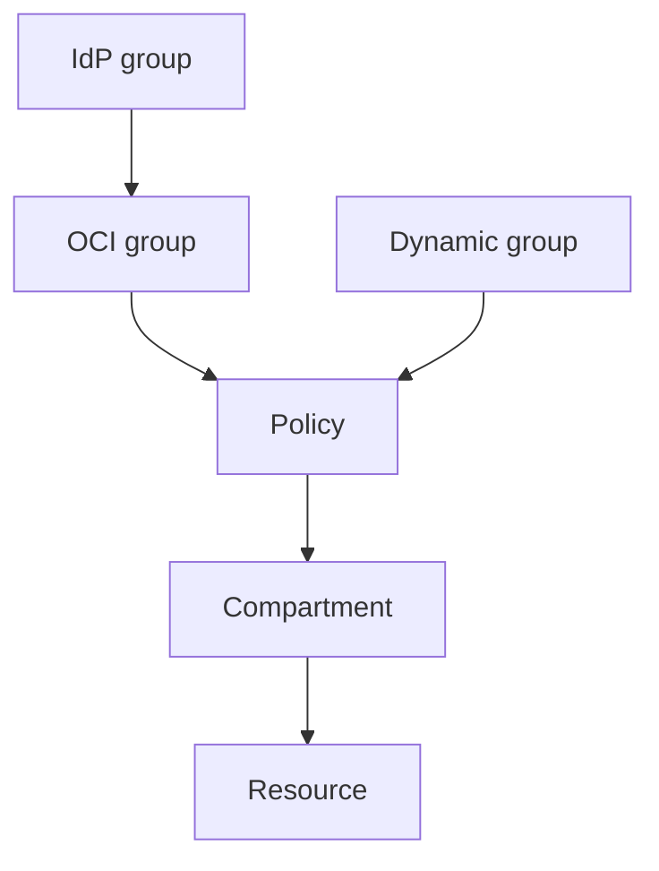

import { ConceptTemplate } from '@/features/kb/components/templates/ConceptTemplate'
import { Callout } from '@/features/kb/components/mdx/Callout'
import { ComparisonTable } from '@/features/kb/components/mdx/ComparisonTable'

export default function Layout({ children }) {
  return (
    <ConceptTemplate title="OCI IAM">
      {children}
    </ConceptTemplate>
  )
}

**OCI IAM** (Identity and Access Management) authorizes every API call. Humans are **users** in **groups** (often federated from an IdP). Workloads are **dynamic groups**. **Policies** are English-like statements: `allow group G to verb resource-type in compartment C`. The tenancy is the root of the compartment tree.

## 1. Deep Dive and Mechanics

**Verbs.** `inspect`, `read`, `use`, `manage` are increasing sets. `use` is the usual app-level. `manage` includes delete. There is no hidden fifth verb that means "please be careful."

**Federation.** SAML/OIDC IdP maps groups to OCI groups. Local users are for break-glass. Identity domains (newer IAM) add more IdP and app features — know which tenancy generation you are on.

**AuthN vs AuthZ.** API signing (user or instance principal) proves who. Policies decide if the verb is allowed on that OCID.

**Network source and conditions.** Restrict by IP or further `where` clauses (bucket name, tag). Conditions are how you avoid `manage object-family in tenancy`.

<Callout icon="error" title="manage all-resources in tenancy">
That statement is root. It shows up in "temporary" admin policies and never leaves. Split by family and compartment.
</Callout>

## 2. Mathematical / Theoretical Foundation

Allow is union of matching statements. There is no deny-first tradition like some clouds (except where you add explicit restrictions). The first over-broad `manage` wins in practice.

Least privilege is choosing the smallest verb and resource-type that still lets the job complete. Family types (`instance-family`) are bundles — read what they include.

<ComparisonTable
  headers={['Idea', 'OCI', 'AWS']}
  rows={[
    ['Statement', 'Policy allow line', 'JSON policy'],
    ['Scope', 'Compartment', 'Account + ARN'],
    ['Workload ID', 'Dynamic group', 'IAM role'],
    ['Federation', 'IdP + identity domain', 'IAM IdC / SAML'],
  ]}
/>

## 3. Real-World Implementation

```text
allow group Deployers to manage instance-family in compartment prod
allow group Deployers to use virtual-network-family in compartment network
allow group Deployers to read repos in compartment shared-images
```

Three lines beat one `manage all-resources`. Put them in a policy object you review in git.

## 4. Visualizations



## 5. Interview Prep

**Q: How do you write least privilege?**
**A:** Tight group, tight verb, tight resource-type, tight compartment, plus `where` if needed. Start from inspect/read and climb.

**Q: User vs resource principal?**
**A:** Users are people (or service accounts you should not use on VMs). Resource/instance principals are for code.

**Q: What is a policy attachment?**
**A:** Policies live in a compartment and apply to a scope you name. Putting every policy in root is legal and messy.

## 6. Production Use Cases

- Landing-zone policy packs per compartment.
- Federated on-call group with `use` on prod, `manage` on nonprod.
- Dynamic group for CI that can push images but not rewrite VCNs.

<Callout icon="tip" title="Read the verb/resource tables">
Oracle publishes what `use buckets` includes. Guessing is how `manage` sneaks back in.
</Callout>
