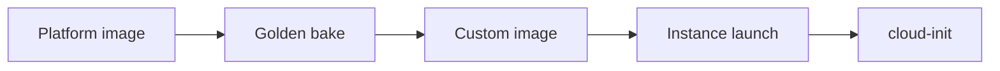

import { ConceptTemplate } from '@/features/kb/components/templates/ConceptTemplate'
import { Callout } from '@/features/kb/components/mdx/Callout'
import { ComparisonTable } from '@/features/kb/components/mdx/ComparisonTable'

export default function Layout({ children }) {
  return (
    <ConceptTemplate title="OCI Images">
      {children}
    </ConceptTemplate>
  )
}

An **image** is the boot disk template for an instance. **Platform images** (Oracle Linux, Ubuntu, Windows) are Oracle-published and move. **Custom images** are snapshots you own. **Marketplace** images add vendor appliances. Image OCID is a launch-time pin.

## 1. Deep Dive and Mechanics

**Create custom.** You generalize a golden VM (remove SSH host keys, sysprep on Windows) and `create-image`. That image is compartment-scoped and AD-independent as an object, but it still boots volumes into an AD.

**Import/export.** Bring a QCOW2/VMDK via Object Storage. Licensing and virtio/paravirtual drivers are the usual import failures.

**Lifecycle.** Platform image OCIDs rotate. Terraform that pins yesterday's Oracle Linux OCID is good; Terraform that always takes "latest" is a surprise kernel.

**Cloud-init.** Images should be cattle-ready: agent, logging, hardening. Instance metadata supplies the rest.

<Callout icon="warning" title="Secrets in images">
A baked-in API key or well-known SSH key is immortal. Scan images. Inject secrets at launch from Vault.
</Callout>

## 2. Mathematical / Theoretical Foundation

Image sprawl is a set that only grows. Each unpatched custom image is a CVE baseline. A pipeline that rebuilds monthly and marks old images retired is the control.

Launch time includes image-to-boot-volume clone. Huge images slow scale-out.

<ComparisonTable
  headers={['Type', 'Who owns updates', 'Use']}
  rows={[
    ['Platform', 'Oracle', 'Baseline OS'],
    ['Custom', 'You', 'Golden / CIS'],
    ['Marketplace', 'Vendor + you', 'Appliances'],
    ['OKE node', 'Oracle / you', 'Kube-optimized'],
  ]}
/>

## 3. Real-World Implementation

```bash
oci compute image create --instance-id $GOLDEN \
  --display-name ol9-cis-2026-09-07 --compartment-id $COMP

oci compute instance launch --image-id $IMAGE ...
```

Record the image OCID in the same git commit as the instance template.

## 4. Visualizations



## 5. Interview Prep

**Q: Image vs boot volume?**
**A:** Image is the template. Launch copies it to a boot volume you can later detach or snapshot.

**Q: How do you patch?**
**A:** Rebuild the image, roll instance pools. In-place yum is a pet.

**Q: Cross-region?**
**A:** Export/import or copy image features. An image OCID is regional.

## 6. Production Use Cases

- CIS-hardened Oracle Linux for all app pools.
- Windows marketplace image plus your sysprep.
- Import of a vendor NVA for inspection.

<Callout icon="tip" title="Pin and retire">
Allowlist image OCIDs in policy or pipeline. "Any image in the compartment" is how a test Ubuntu becomes prod.
</Callout>
