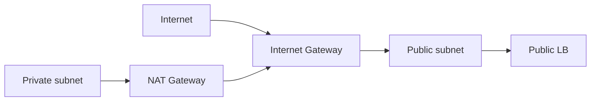

import { ConceptTemplate } from '@/features/kb/components/templates/ConceptTemplate'
import { Callout } from '@/features/kb/components/mdx/Callout'
import { ComparisonTable } from '@/features/kb/components/mdx/ComparisonTable'

export default function Layout({ children }) {
  return (
    <ConceptTemplate title="OCI Internet Gateway">
      {children}
    </ConceptTemplate>
  )
}

An **Internet Gateway (IGW)** is a regional, highly available hop that connects a VCN to the public internet. Traffic uses the IGW only if a **route table** sends `0.0.0.0/0` (or a public prefix) to it **and** the VNIC has a public IP. Private instances do not sneak out through the IGW.

## 1. Deep Dive and Mechanics

**Attachment.** One IGW per VCN is the usual pattern. It is not a VM you patch. Enable/disable is a blunt switch.

**Public IP.** Ephemeral or reserved public IPs live on the VNIC. Without one, IGW routes do nothing for that instance.

**Ingress.** IGW allows inbound to public IPs if NSGs/security lists allow. The IGW is not a WAF. Pair with a load balancer and NSGs.

**IPv6.** VCNs can carry IPv6; IGW handles those routes too when enabled. Do not forget NSGs for ::/0.

<Callout icon="error" title="SSH from the world">
22 open to 0.0.0.0/0 plus an IGW is a scanner magnet. Bastion service, VPN, or at least a tight CIDR.
</Callout>

## 2. Mathematical / Theoretical Foundation

Default route specificity: a more specific RFC1918 route to a DRG beats 0.0.0.0/0 to the IGW. Mis-ordered mental models cause "why does this VM use the internet for 10/8."

Egress billing: public egress through IGW has a price. Architect to keep east-west private.

<ComparisonTable
  headers={['Door', 'Who uses it', 'Direction']}
  rows={[
    ['Internet Gateway', 'Public IP resources', 'In and out'],
    ['NAT Gateway', 'Private resources', 'Out only'],
    ['Service Gateway', 'Private to OCI services', 'Out to services'],
    ['DRG', 'Hybrid / other VCNs', 'Private WAN'],
  ]}
/>

## 3. Real-World Implementation

```bash
oci network internet-gateway create --compartment-id $COMP \
  --vcn-id $VCN --is-enabled true --display-name igw

oci network route-table update --rt-id $PUBLIC_RT \
  --route-rules '[{"cidrBlock":"0.0.0.0/0","networkEntityId":"'"$IGW"'"}]'
```

Only the public subnet route table should point at the IGW.

## 4. Visualizations



## 5. Interview Prep

**Q: Why can't my private VM reach the internet via IGW?**
**A:** No public IP. Use NAT Gateway for egress. That is by design.

**Q: IGW vs NAT?**
**A:** IGW is bidirectional for public IPs. NAT is outbound only for private IPs.

**Q: How many IGWs?**
**A:** Typically one per VCN. More is unusual and confusing.

## 6. Production Use Cases

- Public load balancer subnet route to IGW.
- Bastion in a tiny public subnet, apps private.
- IPv6 dual-stack edge.

<Callout icon="tip" title="Split route tables">
Public and private subnets must not share a 0.0.0.0/0 to the IGW. That is how private instances get accidental public IPs and a path.
</Callout>
