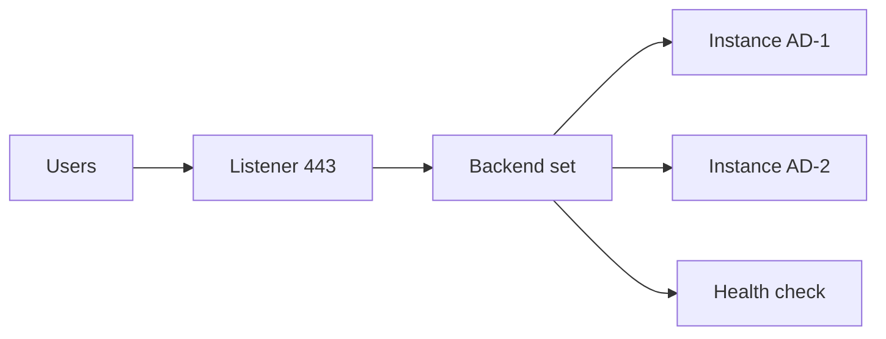

import { ConceptTemplate } from '@/features/kb/components/templates/ConceptTemplate'
import { Callout } from '@/features/kb/components/mdx/Callout'
import { ComparisonTable } from '@/features/kb/components/mdx/ComparisonTable'

export default function Layout({ children }) {
  return (
    <ConceptTemplate title="OCI Load Balancer">
      {children}
    </ConceptTemplate>
  )
}

The **OCI Load Balancer** is a regional reverse proxy (HTTP/HTTPS/TCP/WebSocket). You pick public or private, a shape or flexible bandwidth, listeners, backend sets, and health checks. The **Network Load Balancer (NLB)** is the passthrough / DSR-style sibling when you must preserve client IP and avoid proxy buffers.

## 1. Deep Dive and Mechanics

**Regional.** Backends can sit in multiple ADs. The LB VNICs land in your subnets (often a dedicated pair). NSGs on the LB and on backends are both required.

**HTTP features.** Path routing, session cookies, header rewrites, and certs in the LB or via Vault. Backend sets have policies (weighted, round robin).

**Health checks.** Status codes and timeouts decide membership. A too-strict check flapping is an outage you invented.

**NLB.** Layer-4, high throughput, source IP preservation. No fancy URL maps. Use it for TCP services and some Kubernetes.

<Callout icon="warning" title="Idle timeout vs app timeout">
Long uploads die at the LB if the idle timeout is shorter than the handler. Align both numbers.
</Callout>

## 2. Mathematical / Theoretical Foundation

Capacity is bandwidth shape / flexible max. Burst above the shape is dropped or queued. Load test the LB and the backends.

Health check interval × unhealthy threshold is the detection time. Too fast + noisy app = flapping. Too slow = serving dead nodes.

<ComparisonTable
  headers={['Type', 'Layer', 'Pick when']}
  rows={[
    ['Load Balancer', 'L7 / proxy', 'HTTP, TLS, routing'],
    ['Network LB', 'L4', 'IP preserve, speed'],
    ['API Gateway', 'HTTP + auth', 'API products'],
    ['DNS only', 'Name', 'Not a health check'],
  ]}
/>

## 3. Real-World Implementation

```bash
oci lb load-balancer create --compartment-id $COMP \
  --display-name web --shape-name flexible \
  --subnet-ids '["'"$SUB1"'","'"$SUB2"'"]' \
  --is-private false
```

Then add a backend set, backends, listener, and a cert. Terraform the whole graph.

## 4. Visualizations



## 5. Interview Prep

**Q: Public vs private LB?**
**A:** Public gets a public IP and needs an IGW path. Private is VCN-only for internal APIs.

**Q: LB vs NLB?**
**A:** LB for HTTP features. NLB for raw TCP and client IP. Kubernetes often wants NLB for Services.

**Q: Where do certificates live?**
**A:** On the LB or referenced from a vault. Do not copy PEMs into instance userdata.

## 6. Production Use Cases

- Multi-AD HTTP app with cookie stickiness only if you must.
- Private LB in front of ATP-facing middleware.
- NLB for a TCP protocol the HTTP LB cannot parse.

<Callout icon="tip" title="Drain before you scale in">
Mark backends offline or use connection draining. Instant terminate is a 502 generator.
</Callout>
