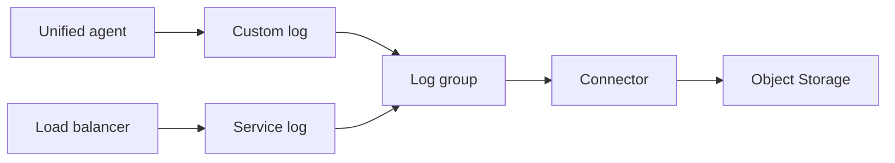

import { ConceptTemplate } from '@/features/kb/components/templates/ConceptTemplate'
import { Callout } from '@/features/kb/components/mdx/Callout'
import { ComparisonTable } from '@/features/kb/components/mdx/ComparisonTable'

export default function Layout({ children }) {
  return (
    <ConceptTemplate title="OCI Logging">
      {children}
    </ConceptTemplate>
  )
}

**OCI Logging** collects **service logs** (flow logs, LB access, Object Storage) and **custom logs** from the Unified Monitoring Agent into **log groups** and **logs**. Search and dashboards live in Logging Analytics or raw Logging search. Rules can forward to Streaming, Functions, or Object Storage.

## 1. Deep Dive and Mechanics

**Log group.** A compartment-scoped bucket of logs with a retention. IAM `read logs` is usually granted on the group, not the tenancy.

**Service logs.** Enable per resource (subnet flow logs, for example). They have a cost and a volume surprise on chatty VCNs.

**Custom logs.** Agent on compute tails files or systemd and ships with a config. Dynamic groups allow the agent to write.

**Routing.** Service Connector Hub (or equivalent connectors) moves logs to Object Storage for cheap long-term, or to SIEM.

<Callout icon="warning" title="Flow logs on a busy subnet">
Every accepted packet can become a line you pay to store. Sample or enable only on edge subnets unless you have a reason.
</Callout>

## 2. Mathematical / Theoretical Foundation

Cost ≈ ingest + storage × retention. Doubling retention doubles the tail of the bill. Compliance wants 1 year; debug wants 7 days. Split log groups.

Cardinality: high-cardinality labels explode Logging Analytics indexes. Do not label per request id as a dimension you facet.

<ComparisonTable
  headers={['Product', 'Role', 'Analog']}
  rows={[
    ['Logging', 'Ingest + search', 'CloudWatch Logs'],
    ['Logging Analytics', 'ML search / parse', 'Athena + SIEM lite'],
    ['Object Storage archive', 'Cheap retain', 'S3 + Glacier'],
    ['Streaming', 'Fan-out consume', 'Kinesis / PubSub'],
  ]}
/>

## 3. Real-World Implementation

```text
allow dynamic-group app-instances to use log-content in compartment prod

# Agent unified config tails /var/log/app/app.log into a custom log OCID
```

Create the log and log group first; the agent config references OCIDs.

## 4. Visualizations



## 5. Interview Prep

**Q: Service log vs custom log?**
**A:** Service logs come from OCI resources you enable. Custom logs come from your process via the agent or API.

**Q: Where should audit logs go?**
**A:** A locked compartment, longer retention, maybe a second tenancy sink. App debug logs should not share that IAM.

**Q: How do you alert on a log line?**
**A:** Connector to Functions or Monitoring-compatible pipeline. Logging search alone is not an on-call.

## 6. Production Use Cases

- LB 5xx logs to a connector that pages.
- Flow logs on the public subnet for incident review.
- App JSON logs with 14-day hot retention and 1-year Object Storage.

<Callout icon="tip" title="JSON one line per event">
Multiline stack traces without a well-defined parse rule become glue. Structured logs survive the trip to Analytics.
</Callout>
