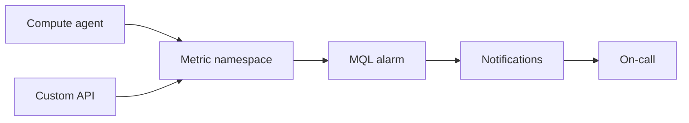

import { ConceptTemplate } from '@/features/kb/components/templates/ConceptTemplate'
import { Callout } from '@/features/kb/components/mdx/Callout'
import { ComparisonTable } from '@/features/kb/components/mdx/ComparisonTable'

export default function Layout({ children }) {
  return (
    <ConceptTemplate title="OCI Monitoring">
      {children}
    </ConceptTemplate>
  )
}

**OCI Monitoring** stores time-series from OCI services and from the **custom metrics** API. You query with **MQL**, chart in consoles or Grafana, and fire **alarms** to Notifications (email, Slack, Pager). Agents emit compute metrics; apps should emit RED/USE metrics too.

## 1. Deep Dive and Mechanics

**Namespace and metric.** `oci_computeagent` vs `oci_lb` vs your `app.orders`. Dimensions (instance id, AD, shape) are the group-by keys.

**Alarms.** Query + operator + pending period + severity + destination. Missing-data treatment matters: a dead agent looks like "all green" if you ignore absences.

**Custom metrics.** API or agent. Cardinality limits exist. A dimension per user id will be throttled or expensive.

**Retention.** Fine-resolution data ages out. Long-term capacity planning needs a downsample export.

<Callout icon="warning" title="Alarm on missing data">
`absent()` (or equivalent) for heartbeat metrics. A silent host is an incident, not a vacation from CPU alerts.
</Callout>

## 2. Mathematical / Theoretical Foundation

MQL aggregations: avg/min/max/rate over a window. Rate of a counter is the useful number; raw counters only go up.

Error budget: alarm thresholds should match SLOs, not "CPU greater than 80" on a correctly busy box.

<ComparisonTable
  headers={['Signal', 'Tool', 'Action']}
  rows={[
    ['Metrics', 'Monitoring + MQL', 'Alarms'],
    ['Logs', 'Logging', 'Connectors'],
    ['Traces', 'APM (if used)', 'Latency debug'],
    ['Events', 'Events service', 'Automation'],
  ]}
/>

## 3. Real-World Implementation

```text
CpuUtilization[1m]{resourceId = "ocid1.instance..."}.mean() > 85
```

Attach that query to an alarm with a 5-minute pending period and a Notification topic the on-call actually follows.

## 4. Visualizations



## 5. Interview Prep

**Q: Metrics vs logs for paging?**
**A:** Metrics for SLOs and saturation. Logs for explanation. Page on metrics; jump to logs after.

**Q: What is MQL?**
**A:** Monitoring Query Language — select metric, filter dimensions, aggregate, compare.

**Q: Why is my custom metric empty?**
**A:** Wrong namespace, missing IAM on the dynamic group, or a dimension set that never repeats (cardinality drop).

## 6. Production Use Cases

- LB 5xx rate and p99 latency alarms.
- Disk used percent on boot and data volumes.
- Business metric: checkout success rate as a custom metric.

<Callout icon="tip" title="One topic per urgency">
Do not dump INFO and SEV1 on the same email list. People will filter all of it.
</Callout>
