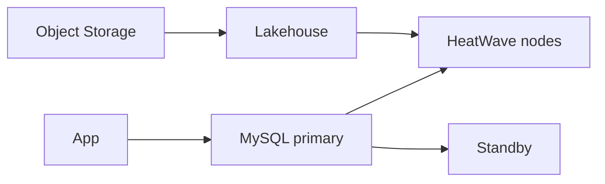

import { ConceptTemplate } from '@/features/kb/components/templates/ConceptTemplate'
import { Callout } from '@/features/kb/components/mdx/Callout'
import { ComparisonTable } from '@/features/kb/components/mdx/ComparisonTable'

export default function Layout({ children }) {
  return (
    <ConceptTemplate title="MySQL HeatWave">
      {children}
    </ConceptTemplate>
  )
}

**MySQL HeatWave** is Oracle's managed MySQL Database Service with an optional **HeatWave** in-memory cluster that accelerates analytic queries. OLTP stays on the MySQL nodes. Qualifying SQL is offloaded to HeatWave. Lakehouse features can query object store. It is still MySQL protocol to the app.

## 1. Deep Dive and Mechanics

**DB system.** Shape, AD, HA (multi-AD when the region allows), backup window, and private VNIC. Standalone is cheaper and a SPOF.

**HeatWave cluster.** Add nodes, load tables into memory (auto or manual). Queries the optimizer marks as analytic run in the cluster. Changes on MySQL replicate into HeatWave with a lag you must measure.

**Lakehouse.** Maps Parquet/CSV in Object Storage into HeatWave so you do not always ETL into InnoDB first.

**Compatibility.** MySQL 8.x features, not MariaDB, not Postgres. ORMs that emit odd SQL may not offload.

<Callout icon="warning" title="Memory is the working set">
If the hot analytic set does not fit, you bought a cluster that spills or refuses. Size nodes from data volume, not from a blog's node count.
</Callout>

## 2. Mathematical / Theoretical Foundation

Offload decision is cost-based. A point lookup should stay on InnoDB. A large scan/join should go to HeatWave. EXPLAIN is the truth.

HA MySQL uses a primary and standbys. Failover is not zero RPO if you chose async habits. HeatWave reload after failover is extra time.

<ComparisonTable
  headers={['Option', 'OLTP', 'Analytics']}
  rows={[
    ['HeatWave', 'MySQL', 'In-memory cluster'],
    ['ADB ADW', 'Not the point', 'Oracle warehouse'],
    ['Read replica only', 'Primary', 'Limited offload'],
    ['Separate warehouse', 'MySQL', 'ETL + BQ/Redshift'],
  ]}
/>

## 3. Real-World Implementation

```sql
EXPLAIN SELECT c.region, SUM(o.amount)
FROM orders o
JOIN customers c ON c.id = o.customer_id
WHERE o.created_at >= '2026-01-01'
GROUP BY c.region;
-- Look for HeatWave offload in Extra / query plan
```

If it stays on InnoDB, fix the SQL or the loaded table set before you add nodes.

## 4. Visualizations



## 5. Interview Prep

**Q: HeatWave vs a warehouse?**
**A:** Same MySQL connection, less ETL, in-memory speed for the loaded set. A warehouse still wins at multi-engine lakes and huge historical scans you will not load.

**Q: Does HeatWave replace indexes?**
**A:** No. OLTP indexes still matter for the primary. HeatWave is the analytic path.

**Q: How do you isolate analytics load?**
**A:** Offload is the isolation. If queries do not offload, they hurt OLTP. That is the incident.

## 6. Production Use Cases

- SaaS MySQL that grew a BI team without a full warehouse yet.
- Lakehouse over landing-zone Parquet plus operational MySQL.
- Regional HA MySQL for an app that must stay on MySQL drivers.

<Callout icon="tip" title="Load only what you query">
HeatWave memory is not a trophy. Load the tables BI actually uses and evict the rest.
</Callout>
