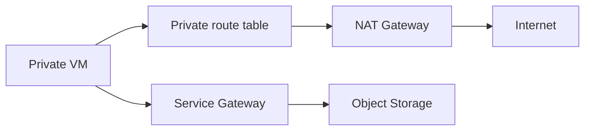

import { ConceptTemplate } from '@/features/kb/components/templates/ConceptTemplate'
import { Callout } from '@/features/kb/components/mdx/Callout'
import { ComparisonTable } from '@/features/kb/components/mdx/ComparisonTable'

export default function Layout({ children }) {
  return (
    <ConceptTemplate title="OCI NAT Gateway">
      {children}
    </ConceptTemplate>
  )
}

A **NAT Gateway** lets instances **without public IPs** initiate outbound connections to the internet (package mirrors, third-party APIs) and receive only the return packets. It is regional and highly available. Inbound unsolicited traffic is dropped. Route `0.0.0.0/0` in the **private** route table to the NAT, not to the IGW.

## 1. Deep Dive and Mechanics

**Placement.** The NAT lives in the VCN. You do not put it in a subnet the way you place a VM. A public IP is allocated to the NAT for egress source.

**Routes.** Private subnet: 0.0.0.0/0 → NAT. Public subnet: 0.0.0.0/0 → IGW. Mix them up and private hosts either cannot egress or you accidentally assigned public IPs.

**Ports.** SNAT uses a finite port pool. Many connections to the same destination tuple can exhaust ports (the "too many HTTPS to one API" problem).

**Alternatives.** Service Gateway for OCI public services (Object Storage) so that traffic never hits the internet or NAT.

<Callout icon="warning" title="NAT is not a filter">
NSGs on the instance still apply to egress. The NAT will happily forward if you allow it. Egress allow-lists belong on NSGs or a proxy.
</Callout>

## 2. Mathematical / Theoretical Foundation

Port capacity: roughly 64k ports per destination:port minus overhead. Connection churn to a single HTTPS endpoint is the failure mode. A proxy or multiple destinations reduces collision.

Cost is NAT hours plus data. Hairpinning large downloads through NAT when Service Gateway exists is wasted money and a longer path.

<ComparisonTable
  headers={['Egress path', 'Source IP', 'Use']}
  rows={[
    ['NAT Gateway', 'NAT public IP', 'General internet'],
    ['IGW + public IP', 'Instance public IP', 'Inbound + outbound'],
    ['Service Gateway', 'Private', 'OCI services'],
    ['DRG', 'Private', 'On-prem'],
  ]}
/>

## 3. Real-World Implementation

```bash
oci network nat-gateway create --compartment-id $COMP \
  --vcn-id $VCN --display-name nat --block-traffic false

# Private route table:
# 0.0.0.0/0 -> nat-gateway OCID
```

Block traffic on the NAT is a kill switch during an incident.

## 4. Visualizations



## 5. Interview Prep

**Q: Why NAT instead of public IPs?**
**A:** No inbound attack surface on the instance IP. One egress identity to allow-list at a vendor.

**Q: Can the internet connect in through NAT?**
**A:** Not for new connections. NAT is outbound-initiated.

**Q: NAT vs proxy?**
**A:** NAT is L3/L4. A forward proxy adds auth, inspect, and cache. Regulated egress often wants both: NAT for path, proxy for policy.

## 6. Production Use Cases

- Private app subnets that must `yum` and call SaaS APIs.
- Functions in private subnets reaching the public internet.
- Emergency `block-traffic` during a callback-storm incident.

<Callout icon="tip" title="Prefer Service Gateway for OCI APIs">
Object Storage and many OCI endpoints should not burn NAT ports or internet egress. Point a service CIDR at the Service Gateway.
</Callout>
