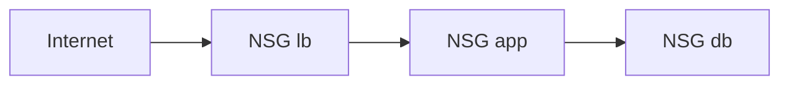

import { ConceptTemplate } from '@/features/kb/components/templates/ConceptTemplate'
import { Callout } from '@/features/kb/components/mdx/Callout'
import { ComparisonTable } from '@/features/kb/components/mdx/ComparisonTable'

export default function Layout({ children }) {
  return (
    <ConceptTemplate title="OCI Network Security Groups">
      {children}
    </ConceptTemplate>
  )
}

A **Network Security Group (NSG)** is a stateful virtual firewall you attach to VNICs (instances, LB, mount targets, database endpoints). Rules allow ingress or egress by CIDR, **or by another NSG** (security-group referencing). A VNIC can have multiple NSGs; the union of allow rules applies.

## 1. Deep Dive and Mechanics

**Stateful.** An allowed inbound connection may reply even if you did not write the reverse. Egress still needs an allow for new outbound connections.

**NSG as source.** `app` NSG can allow from `lb` NSG on 8080 without writing CIDRs that go stale when the LB scales.

**Security lists.** Subnet-level lists still exist. A packet is allowed if **either** a security list **or** an NSG on the VNIC allows it. A wide subnet list makes your tight NSG pointless.

**Limits.** Rule counts and NSGs per VNIC have caps. Micro-segmentation still needs a design, not one rule per IP.

<Callout icon="warning" title="OR with security lists">
People tighten NSGs and leave a security list of 0.0.0.0/0 on the subnet. The effective policy is the wide one. Audit both.
</Callout>

## 2. Mathematical / Theoretical Foundation

Effective allow = union(lists on subnet, NSGs on VNIC). There is no "most specific deny" tradition like some NACLs. Default deny is implied only if nothing allows.

Stateful tracking is a conntrack table. Long idle flows die if timeouts are shorter than the app.

<ComparisonTable
  headers={['Control', 'Attaches to', 'Best for']}
  rows={[
    ['NSG', 'VNIC / NIC set', 'Role-based rules'],
    ['Security list', 'Subnet', 'Coarse defaults'],
    ['NACL analog', 'Subnet stateless (AWS)', 'Not OCI NSG'],
    ['IAM', 'API', 'Not packet filter'],
  ]}
/>

## 3. Real-World Implementation

```text
# NSG lb: ingress 443 from 0.0.0.0/0
# NSG app: ingress 8080 from NSG lb
# NSG app: egress 443 to 0.0.0.0/0 (or to NAT)
# NSG db: ingress 1521 from NSG app
```

No CIDR of the LB subnet required if you reference the LB NSG.

## 4. Visualizations



## 5. Interview Prep

**Q: NSG vs security list?**
**A:** NSG is per-VNIC and can reference other NSGs. Security list is per subnet. Prefer NSGs; keep lists minimal.

**Q: Are NSGs stateful?**
**A:** Yes. Like AWS security groups, unlike AWS NACLs.

**Q: Multiple NSGs?**
**A:** Union of allows. Use composition (base-egress + role-ingress) instead of one giant group.

## 6. Production Use Cases

- Three-tier NSG chain: edge, app, data.
- Mount target NSG that only allows NFS from app NSG.
- Database private endpoint NSG that never allows the public subnet.

<Callout icon="tip" title="Empty the default security list">
New VCNs often ship a generous default list. Replace it with deny-all (or SSH from bastion only) so NSGs become the real policy.
</Callout>
