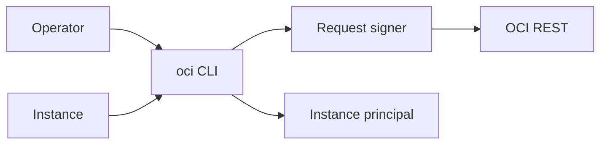

import { ConceptTemplate } from '@/features/kb/components/templates/ConceptTemplate'
import { Callout } from '@/features/kb/components/mdx/Callout'
import { ComparisonTable } from '@/features/kb/components/mdx/ComparisonTable'

export default function Layout({ children }) {
  return (
    <ConceptTemplate title="OCI CLI">
      {children}
    </ConceptTemplate>
  )
}

The **OCI CLI** (`oci`) is a Python-based wrapper around the REST APIs. It reads `~/.oci/config` (or env vars / instance principals) and signs requests. Almost every console click has a CLI equivalent. `--help` and `--generate-full-command-json-input` are how you discover fields.

## 1. Deep Dive and Mechanics

**Auth.** API key user, session tokens, instance principals, resource principals. CI should not use a human's PEM.

**Profiles.** `[DEFAULT]` and named profiles with different tenancy, region, and key. `OCI_CLI_PROFILE` switches.

**Output.** JSON by default (or table). `--query` uses JMESPath. Scripts should parse JSON, not tables.

**Waiters.** Many commands support `--wait-for-state` so you do not poll blindly.

<Callout icon="error" title="Keys in git and chat">
The PEM next to `~/.oci/config` is a user. Treat it like a password. Prefer instance principals on CI runners in OCI, or federation.
</Callout>

## 2. Mathematical / Theoretical Foundation

Signing: each request has a date and a signature over the path and headers. Clock skew fails auth. NTP matters.

Rate limits: a tight bash loop of `list` calls will 429. Use list pagination tokens, not sleep-and-hope only.

<ComparisonTable
  headers={['Tool', 'For', 'Auth']}
  rows={[
    ['oci CLI', 'Humans / scripts', 'Config / principals'],
    ['Terraform', 'State', 'Same APIs'],
    ['SDK', 'Apps', 'Principals'],
    ['Console', 'Click-ops', 'SSO session'],
  ]}
/>

## 3. Real-World Implementation

```bash
oci setup config
oci iam region list
oci compute instance list --compartment-id $COMP --output table
oci os object put --bucket-name b --file ./f --auth instance_principal
```

On an instance, `--auth instance_principal` should be the default in cron.

## 4. Visualizations



## 5. Interview Prep

**Q: CLI vs Terraform?**
**A:** CLI is imperative and great for debug. Terraform is the desired state. Do not mix both on the same resource without a plan.

**Q: How does instance_principal work?**
**A:** The CLI fetches a leaf cert from the metadata service and signs as the instance, which must match a dynamic group.

**Q: Why 401 after a laptop sleep?**
**A:** Clock skew or an expired session token. Refresh auth.

## 6. Production Use Cases

- Break-glass listing of NSGs during an incident.
- Image copy scripts between regions.
- CI that uses instance principals, never a checked-in PEM.

<Callout icon="tip" title="Generate JSON input">
`--generate-full-command-json-input` dumps every field. That is faster than guessing nested `--from-json` shapes.
</Callout>
