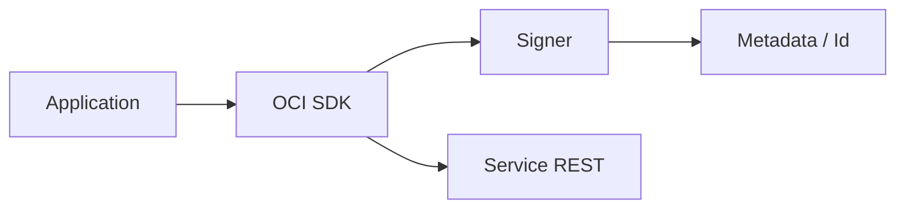

import { ConceptTemplate } from '@/features/kb/components/templates/ConceptTemplate'
import { Callout } from '@/features/kb/components/mdx/Callout'
import { ComparisonTable } from '@/features/kb/components/mdx/ComparisonTable'

export default function Layout({ children }) {
  return (
    <ConceptTemplate title="OCI SDK">
      {children}
    </ConceptTemplate>
  )
}

**OCI SDKs** are official clients (Python, Java, Go, .NET, TypeScript, Ruby) for the public APIs. They handle request signing, retries, and pagination. Config file, env, instance principals, and resource principals are the auth providers. The CLI is built on the Python SDK.

## 1. Deep Dive and Mechanics

**Clients.** One client class per service (`ComputeClient`, `ObjectStorageClient`). You pass a `config` dict or a signer.

**Signers.** `InstancePrincipalsSecurityTokenSigner` on VMs. Resource principal signer on Functions. User principal from `~/.oci/config` on a laptop.

**Retries.** Default retry on 429/5xx. Idempotent GETs are safe. POSTs that create resources need idempotency tokens or careful retry.

**Pagination.** List calls return tokens. SDK paginators exist; do not assume one page.

<Callout icon="warning" title="User config in a container">
Baking `~/.oci/config` plus a PEM into a Docker image is a leaked user. Use the instance or resource principal signer.
</Callout>

## 2. Mathematical / Theoretical Foundation

Signing string includes date, path, and selected headers. Replay windows are short. Do not log the authorization header.

Backoff is exponential with jitter. A synchronized retry storm after an outage is how you extend the outage.

<ComparisonTable
  headers={['Runtime', 'Signer', 'Typical']}
  rows={[
    ['Laptop', 'API key / session', 'Dev'],
    ['Compute', 'Instance principal', 'Apps / agents'],
    ['Functions', 'Resource principal', 'FaaS'],
    ['OKE', 'Workload / instance', 'Pods'],
  ]}
/>

## 3. Real-World Implementation

```python
import oci

signer = oci.auth.signers.InstancePrincipalsSecurityTokenSigner()
client = oci.object_storage.ObjectStorageClient(config={}, signer=signer)
ns = client.get_namespace().data
client.put_object(ns, "app-artifacts", "ok.txt", b"ok")
```

Empty `config` plus signer is the instance-principal pattern.

## 4. Visualizations



## 5. Interview Prep

**Q: SDK vs REST?**
**A:** Same APIs. SDK does signing and models. REST is what you debug in logs.

**Q: How do you test without OCI?**
**A:** Interface the client, record/replay, or use a small integration project. Do not skip IAM path tests.

**Q: Thread safety?**
**A:** Clients are generally reusable. Check the language SDK notes before sharing a signer across forks.

## 6. Production Use Cases

- Apps that mint PARs or rotate secrets in Vault.
- Operators tools in Go that list unhealthy backends.
- Functions that write an object on an event.

<Callout icon="tip" title="Pin SDK versions">
A major SDK bump can rename models. Lock versions like any other HTTP client.
</Callout>
