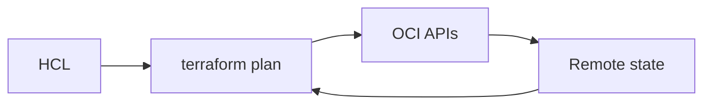

import { ConceptTemplate } from '@/features/kb/components/templates/ConceptTemplate'
import { Callout } from '@/features/kb/components/mdx/Callout'
import { ComparisonTable } from '@/features/kb/components/mdx/ComparisonTable'

export default function Layout({ children }) {
  return (
    <ConceptTemplate title="OCI Terraform Provider">
      {children}
    </ConceptTemplate>
  )
}

The **OCI Terraform provider** (`oracle/oci` or `hashicorp/oci` lineage) maps HCL to OCI REST. Provider blocks set tenancy OCID, user, fingerprint, region, or instance-principal flags. Each service has resources (`oci_core_vcn`) and data sources. State must be remote and locked.

## 1. Deep Dive and Mechanics

**Auth.** API key for a pipeline user is common; instance principals on an OCI-hosted runner is better. `auth = "InstancePrincipal"` in the provider.

**Region.** One provider alias per region if you multi-region. Image OCIDs and ADs are regional — data sources should look them up.

**Compartments.** Almost every resource takes `compartment_id`. Modules should receive it as a variable, not a hardcoded root.

**Import.** Existing console resources can be imported. Refresh drift if humans still click.

<Callout icon="error" title="State has secrets">
Some resources store wallet passwords or PAR details. Use a remote backend with encryption and tight IAM. Never commit `terraform.tfstate`.
</Callout>

## 2. Mathematical / Theoretical Foundation

Desired state vs actual: `plan` is a diff of HCL and refresh. Out-of-band console edits show as noise or destroy. One writer per resource.

Provider version pins avoid surprise field deprecations. `~>` is a policy, not a hope.

<ComparisonTable
  headers={['Tool', 'Model', 'Risk']}
  rows={[
    ['Terraform + oci', 'Desired state', 'State drift'],
    ['Resource Manager', 'Managed TF', 'Less local state'],
    ['CLI scripts', 'Imperative', 'No refresh'],
    ['Console', 'Click', 'No review'],
  ]}
/>

## 3. Real-World Implementation

```hcl
provider "oci" {
  auth   = "InstancePrincipal"
  region = "us-phoenix-1"
}

resource "oci_core_vcn" "this" {
  compartment_id = var.network_compartment_id
  cidr_blocks    = ["10.10.0.0/16"]
  display_name   = "prod"
}
```

Alias a second provider for `us-ashburn-1` DR resources.

## 4. Visualizations



## 5. Interview Prep

**Q: Why instance principal for Terraform?**
**A:** No PEM on the runner. Dynamic group + policy is the CI identity.

**Q: How do you handle three ADs?**
**A:** Data source `oci_identity_availability_domains` and index carefully. Do not paste a neighbor tenancy's AD name.

**Q: Resource Manager vs DIY Terraform?**
**A:** Resource Manager is Oracle-hosted state and jobs. DIY is more portable. Both use this provider.

## 6. Production Use Cases

- Landing-zone modules: compartments, VCNs, policies.
- App stacks that take a subnet OCID and emit an LB IP.
- Multi-region provider aliases for DR.

<Callout icon="tip" title="Data-source the AD and image">
Hardcoded image OCIDs rot. A data source with a filter plus a pin to a date-named image is the usual compromise.
</Callout>
