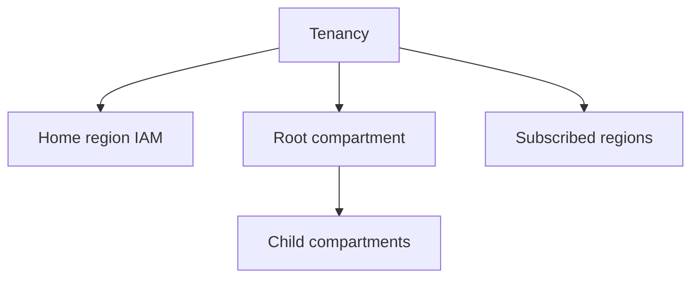

import { ConceptTemplate } from '@/features/kb/components/templates/ConceptTemplate'
import { Callout } from '@/features/kb/components/mdx/Callout'
import { ComparisonTable } from '@/features/kb/components/mdx/ComparisonTable'

export default function Layout({ children }) {
  return (
    <ConceptTemplate title="OCI Tenancy">
      {children}
    </ConceptTemplate>
  )
}

A **tenancy** is your OCI account. It has a globally unique OCID, a **home region** (where IAM metadata lives), a root compartment, and a subscription/credits contract. All compartments, users, and regions you subscribe to sit under that tenancy.

## 1. Deep Dive and Mechanics

**Home region.** Identity resources are mastered there. You can use other subscribed regions for data plane. Moving home region is not a casual rename.

**Subscribe regions.** Capacity and services appear only in regions you enabled. A Terraform apply in an unsubscribed region fails loudly.

**Root compartment.** The tenancy OCID is also the root compartment OCID. Policies `in tenancy` are global. That is why landing zones create children immediately.

**Limits.** Service limits are tenancy-plus-region. Raising GPU limits is a support/ticket process, not a checkbox on a VM.

<Callout icon="warning" title="One tenancy vs many">
A single tenancy with compartments is simpler billing. Separate tenancies isolate blast radius and contracts (prod vs sandbox, or acquired company). Both are valid; mixing without a plan is not.
</Callout>

## 2. Mathematical / Theoretical Foundation

Blast radius of a tenancy admin is the whole contract. Federation + break-glass + no standing `manage all-resources in tenancy` is the control.

Cost allocation: compartments and tags, not "ask finance to split one invoice by folklore."

<ComparisonTable
  headers={['Boundary', 'OCI', 'AWS']}
  rows={[
    ['Contract', 'Tenancy', 'Account / org'],
    ['IAM root', 'Root compartment', 'Account root'],
    ['Home of identity', 'Home region', 'Global IAM'],
    ['Isolation extra', 'Second tenancy', 'Second account'],
  ]}
/>

## 3. Real-World Implementation

```bash
oci iam region-subscription list
oci iam tenancy get --tenancy-id $TENANCY_OCID
```

Write the tenancy OCID and home region in the landing-zone README. People will guess wrong.

## 4. Visualizations



## 5. Interview Prep

**Q: Tenancy vs compartment?**
**A:** Tenancy is the account. Compartments are IAM/quota folders inside it.

**Q: What is home region?**
**A:** Where identity is mastered. Data can live elsewhere. Some IAM operations must target home.

**Q: How do you isolate a risky experiment?**
**A:** Tight compartment + quotas, or a separate tenancy if the risk is contractual.

## 6. Production Use Cases

- Enterprise landing zone in one tenancy, many compartments.
- M&A: second tenancy until identity and network merge.
- Sandbox tenancy with hard spend caps.

<Callout icon="tip" title="Protect the tenancy OCID in docs, not in Slack lore">
Every policy and CLI needs it. Put it in a secrets-safe catalog, not only in one admin's head.
</Callout>
