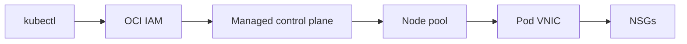

import { ConceptTemplate } from '@/features/kb/components/templates/ConceptTemplate'
import { Callout } from '@/features/kb/components/mdx/Callout'
import { ComparisonTable } from '@/features/kb/components/mdx/ComparisonTable'

export default function Layout({ children }) {
  return (
    <ConceptTemplate title="OCI Container Engine for Kubernetes">
      {children}
    </ConceptTemplate>
  )
}

**OKE** is managed Kubernetes on OCI. Oracle runs the control plane. You create **node pools** (or virtual nodes) in your VCN, plus CNI (native VNIC-per-pod or flannel-style). kubectl auth is OCI IAM or a kubeconfig token flow. It is EKS/GKE/AKS for this cloud.

## 1. Deep Dive and Mechanics

**Cluster types.** Basic vs enhanced, public or private API endpoint. Private API needs a bastion or VPN to talk to the control plane.

**Networking.** VCN-native pods consume IPs from a subnet — plan CIDRs like GKE alias IPs. NSGs on node and pod VNICs replace a lot of kube-proxy folklore.

**Add-ons.** CCM talks to OCI LB and block volumes. CSI for disks and FSS. Cluster autoscaler as a deployment you still watch.

**Identity.** Instance principals on nodes for OCI APIs. Workload identity options exist so pods are not the node.

<Callout icon="warning" title="Pod CIDR exhaustion">
VCN-native clusters die with "failed to assign IP" when the pod subnet is /24 and you scheduled 300 pods. Size the subnet first.
</Callout>

## 2. Mathematical / Theoretical Foundation

Control plane SLA is Oracle's; worker capacity is yours. A regional cluster still needs node pools in more than one AD/FD.

LB integration: each Service type LoadBalancer can mint an OCI LB. Quota on LBs becomes a Kubernetes outage.

<ComparisonTable
  headers={['Service', 'Pod IP model', 'API auth']}
  rows={[
    ['OKE', 'VCN-native or overlay', 'OCI IAM'],
    ['GKE', 'Alias IPs', 'Google IAM'],
    ['EKS', 'VPC CNI', 'IAM authenticator'],
    ['AKS', 'Azure CNI / overlay', 'Entra'],
  ]}
/>

## 3. Real-World Implementation

```bash
oci ce cluster create-kubeconfig --cluster-id $OKE \
  --file $HOME/.kube/config --region us-phoenix-1 \
  --token-version 2.0.0

kubectl get nodes
```

Prefer a private endpoint and a jump path. Public kube-apiserver on 0.0.0.0/0 is a finding.

## 4. Visualizations



## 5. Interview Prep

**Q: OKE vs Container Instances?**
**A:** OKE when you need Kubernetes. Container Instances when you need a box for a few containers.

**Q: How do pods get OCI IAM?**
**A:** Do not use the node principal for app roles. Use workload identity or a dedicated pattern so a hijacked pod is not the node.

**Q: Public vs private cluster?**
**A:** Private API for prod. Public only if you have a strong IP allow list and a reason.

## 6. Production Use Cases

- Multi-pool clusters: system, general, GPU.
- Ingress via OCI LB annotations.
- Shared cluster with namespaces and network policies plus NSGs.

<Callout icon="tip" title="Treat node images like golden VMs">
Rotate node pool images. An unpatched worker is still a Linux host on the internet path of your pods.
</Callout>
