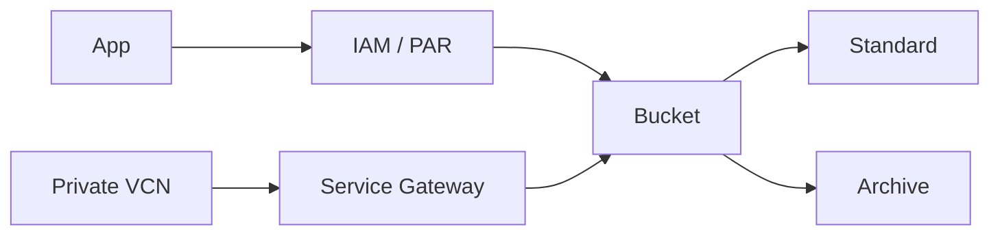

import { ConceptTemplate } from '@/features/kb/components/templates/ConceptTemplate'
import { Callout } from '@/features/kb/components/mdx/Callout'
import { ComparisonTable } from '@/features/kb/components/mdx/ComparisonTable'

export default function Layout({ children }) {
  return (
    <ConceptTemplate title="OCI Object Storage">
      {children}
    </ConceptTemplate>
  )
}

**Object Storage** holds unstructured objects in **buckets**. Namespaces are tenancy-wide (the bucket namespace string). Tiers are Standard, Infrequent Access, and Archive. Access is IAM, pre-authenticated requests (PAR), or (carefully) public buckets. The API is S3-compatible enough for many tools, not identical.

## 1. Deep Dive and Mechanics

**Strong consistency.** Reads after writes for a given object are consistent. List-after-put is designed to be reliable. That is a selling point versus older eventually-consistent stores.

**Tiers and lifecycle.** Lifecycle rules down-tier or delete. Archive restore takes time. Putting "backups" in Standard forever is a bill.

**Encryption.** At rest by default. SSE-C / KMS (Vault) when you must own the wrapping key.

**Private access.** Service Gateway from a VCN so traffic stays off the internet. Bucket policies plus IAM are still required.

<Callout icon="error" title="Public buckets">
A public-read bucket with customer data is a breach. PARs with short TTL beat public. Audit `publicAccessType` continuously.
</Callout>

## 2. Mathematical / Theoretical Foundation

Cost = storage × tier + requests + egress. Small-object chatty workloads die on request charges. Multipart is for large objects, not for 4 KB JSON.

Namespace + bucket + object name is the key. There are no real folders; prefixes are a list illusion.

<ComparisonTable
  headers={['Store', 'Cloud', 'Consistency']}
  rows={[
    ['Object Storage', 'OCI', 'Strong'],
    ['S3', 'AWS', 'Strong (now)'],
    ['GCS', 'GCP', 'Strong'],
    ['Blob', 'Azure', 'Strong'],
  ]}
/>

## 3. Real-World Implementation

```bash
oci os bucket create --name app-artifacts --compartment-id $COMP
oci os object put --bucket-name app-artifacts --file ./app.tgz --name releases/app-1.4.tgz
```

Use a Service Gateway route for `oci-objectstorage` from private subnets.

## 4. Visualizations



## 5. Interview Prep

**Q: Bucket namespace?**
**A:** A unique string per tenancy used in URLs. Bucket names are unique within that namespace.

**Q: PAR vs public?**
**A:** PAR is a time-boxed URL you mint. Public is forever until you notice. Prefer PAR or signed access.

**Q: S3 compatibility?**
**A:** Many SDKs work with the S3-compat endpoint. Features like PAR and IAM statements are OCI-native.

## 6. Production Use Cases

- Artifact and image layers (with lifecycle).
- Database backups aged to Archive.
- Data lake landing zone for HeatWave Lakehouse or Spark.

<Callout icon="tip" title="Versioning on human-writable buckets">
Overwrite protection is cheaper than forensics. Turn on versioning where people or CI can put.
</Callout>
