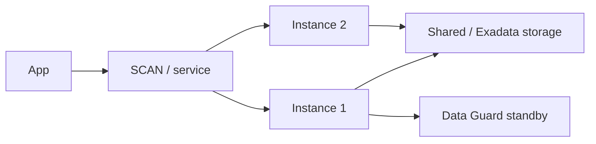

import { ConceptTemplate } from '@/features/kb/components/templates/ConceptTemplate'
import { Callout } from '@/features/kb/components/mdx/Callout'
import { ComparisonTable } from '@/features/kb/components/mdx/ComparisonTable'

export default function Layout({ children }) {
  return (
    <ConceptTemplate title="Oracle Database on OCI">
      {children}
    </ConceptTemplate>
  )
}

**Oracle Database** on OCI ranges from a VM **BaseDB** you patch, to **Exadata Cloud** (dedicated or infrastructure-as-service), to **RAC**, to **Autonomous**. The engine is Oracle SQL, redo, and RMAN-shaped backups. The product choice is who owns the OS, the Grid, and the patching window.

## 1. Deep Dive and Mechanics

**BaseDB.** A managed VM (or BM) with Oracle installed. You get more parameter control and more homework. Data Guard for HA/DR.

**Exadata.** Smart Scan and storage offload for the warehouse/OLTP mixes that justified Exadata on-prem. Cloud@Customer exists when data cannot leave the building.

**RAC.** Multiple instances, one database, shared storage. Needs the network and fencing story. Not a casual checkbox.

**Licensing.** BYOL vs included. This is often the real architecture constraint.

<Callout icon="warning" title="Autonomous is still Oracle">
Hints, plans, and concurrency math did not vanish. Autonomy removes patch panic, not a bad data model.
</Callout>

## 2. Mathematical / Theoretical Foundation

Redo apply lag is the DR number. Async Data Guard has RPO greater than zero. Sync has a latency tax on commit.

RAC cache fusion: extra instances are not linear TPS. Interconnect latency shows up as cluster waits.

<ComparisonTable
  headers={['Offer', 'You patch', 'When']}
  rows={[
    ['Autonomous', 'Little', 'Default new OLTP/WH'],
    ['BaseDB', 'More', 'Custom agents / versions'],
    ['Exadata', 'Infra split', 'Exadata features / scale'],
    ['On-prem C@C', 'Shared', 'Residency'],
  ]}
/>

## 3. Real-World Implementation

```sql
SELECT name, open_mode, database_role FROM v$database;
-- Data Guard / RAC health belongs in OEM or OCI Database Management
```

Backup policy and Data Guard membership should be Terraform plus a runbook, not a verbal "we have RMAN."

## 4. Visualizations



## 5. Interview Prep

**Q: Why OCI for Oracle?**
**A:** Licensing, RAC/Exadata availability, and Autonomous. Other clouds run Oracle too; OCI is where Oracle invests the most metal.

**Q: RAC vs Autonomous HA?**
**A:** RAC is multiple instances you understand. Autonomous HA is Oracle-operated. Interviews want RPO/RTO, not brand loyalty.

**Q: BaseDB vs Autonomous?**
**A:** BaseDB if you need old versions or exotic agents. Autonomous if you want to stop owning patch Tuesday.

## 6. Production Use Cases

- ERP that is certified on a specific Oracle version (BaseDB or Exa).
- Exadata Cloud for a lift of an on-prem Exa workload.
- Autonomous for a new internal OLTP that must stay Oracle SQL.

<Callout icon="tip" title="Write RPO before you pick RAC">
People buy RAC for 'HA' when Data Guard to another AD was the actual requirement. Different problem.
</Callout>
