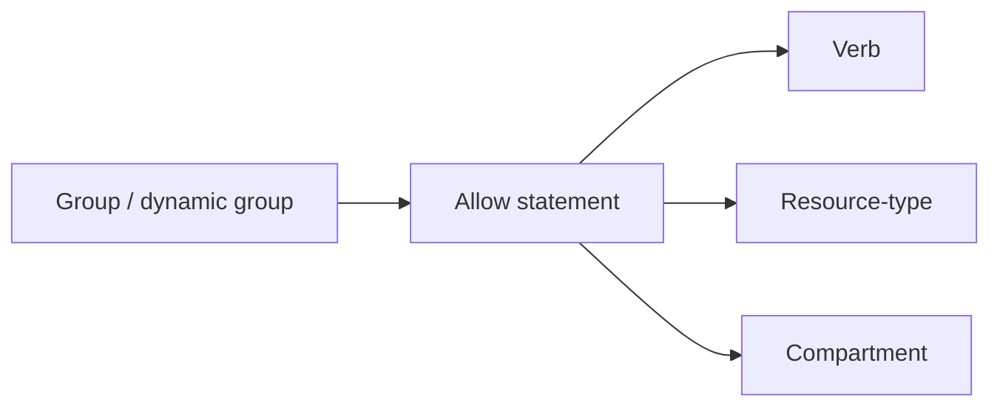

import { ConceptTemplate } from '@/features/kb/components/templates/ConceptTemplate'
import { Callout } from '@/features/kb/components/mdx/Callout'
import { ComparisonTable } from '@/features/kb/components/mdx/ComparisonTable'

export default function Layout({ children }) {
  return (
    <ConceptTemplate title="OCI Policies">
      {children}
    </ConceptTemplate>
  )
}

An OCI **policy** is a named document of **allow** statements. Syntax: `allow subject to verb resource-type in location [where conditions]`. Subjects are groups, dynamic groups, or `any-user` (rare and dangerous). Location is a compartment or the tenancy. This is IAM; it is not a packet filter.

## 1. Deep Dive and Mechanics

**Attachment.** A policy object lives in a compartment. The statements inside name the scope they apply to. Putting all policies in root is common and hard to review.

**Families.** `instance-family`, `volume-family`, `virtual-network-family` bundle types. Read the family table before you grant `manage`.

**Conditions.** `where request.networkSource.name`, `target.bucket.name`, tags. Conditions turn a wide verb into a narrow one.

**Updates.** Policy edits are live. There is no compile step. Git plus a pipeline that applies policies is how you get review.

<Callout icon="error" title="any-user and manage all-resources">
Together they are the internet as tenancy admin. Never. Even apart they deserve a threat model.
</Callout>

## 2. Mathematical / Theoretical Foundation

Authorization is the union of matching allows. More documents can only add access unless you use restrictions/conditions carefully. There is no "later deny wins" habit from some firewalls.

Verb inclusion: `manage` ⊃ `use` ⊃ `read` ⊃ `inspect`. Grant the smallest.

<ComparisonTable
  headers={['Piece', 'Example', 'Avoid']}
  rows={[
    ['Subject', 'group Deployers', 'any-user'],
    ['Verb', 'use', 'manage by habit'],
    ['Scope', 'compartment prod', 'in tenancy'],
    ['Condition', 'bucket name', 'none on wide verbs'],
  ]}
/>

## 3. Real-World Implementation

```text
allow group NetOps to manage virtual-network-family in compartment network
allow group AppOps to manage instance-family in compartment prod
allow group AppOps to use subnets in compartment network
allow dynamic-group ci to manage repos in compartment images
```

Store this as `policies/prod.tf` or a raw file the pipeline applies. Console-only policy is drift.

## 4. Visualizations



## 5. Interview Prep

**Q: Policy vs NSG?**
**A:** Policy is who may call the API. NSG is which packets may flow. You need both to launch and to serve traffic.

**Q: How do you grant read on one bucket?**
**A:** `read objects` in the compartment `where target.bucket.name='x'`. Or put the bucket in its own compartment.

**Q: Can users write policies?**
**A:** Only if you granted `manage policies`. That is a meta-privilege. Keep it in a platform group.

## 6. Production Use Cases

- Landing-zone policy packs reviewed like code.
- Break-glass policy in a separate document with expiry process.
- Dynamic-group statements for instance principals.

<Callout icon="tip" title="One policy document per team boundary">
A 400-line root policy is unreviewable. Split by compartment purpose so diffs are readable.
</Callout>
