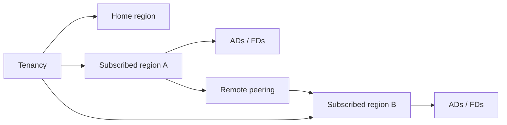

import { ConceptTemplate } from '@/features/kb/components/templates/ConceptTemplate'
import { Callout } from '@/features/kb/components/mdx/Callout'
import { ComparisonTable } from '@/features/kb/components/mdx/ComparisonTable'

export default function Layout({ children }) {
  return (
    <ConceptTemplate title="OCI Regions">
      {children}
    </ConceptTemplate>
  )
}

An OCI **region** is a geographic metro with one or more **availability domains**, its own service endpoints, and its own capacity. Your tenancy has a **home region** for IAM. You **subscribe** additional regions before you can launch there. Commercial, government, and dedicated realms are separate.

## 1. Deep Dive and Mechanics

**Subscribe.** Enabling a region is a tenancy operation. After that, VCNs, buckets, and instances are regional objects with regional OCIDs.

**1-AD vs 3-AD.** Many regions have a single AD. HA inside the region is fault domains. Cross-region is the DR story.

**Endpoints.** SDKs take `region=us-phoenix-1`. Object Storage namespaces are tenancy-global but buckets are regional.

**Paired DR.** Pick a second region with acceptable latency and legal residency. Remote peering and backup copy jobs need both subscribed.

<Callout icon="warning" title="Home region is not your only data region">
Apps can run in Frankfurt while IAM lives in the home region. Some identity edits must still target home. Know which API.
</Callout>

## 2. Mathematical / Theoretical Foundation

Latency: speed of light plus the provider backbone. Sync commit across continents is a product decision, not a checkbox.

Failure correlation: two regions in one political jurisdiction can share a legal event. Residency and DR are different axes.

<ComparisonTable
  headers={['Choice', 'Helps', 'Does not']}
  rows={[
    ['Multi-AD region', 'Building loss', 'Region loss'],
    ['Second region', 'Region loss', 'Bad global IAM'],
    ['Home region only', 'Simplicity', 'User locality'],
    ['Every region', 'Coverage', 'Cost and ops'],
  ]}
/>

## 3. Real-World Implementation

```bash
oci iam region-subscription create --region-key FRA
oci iam region list --all
```

Terraform provider aliases per region. Do not assume a resource is global because IAM is.

## 4. Visualizations



## 5. Interview Prep

**Q: Region vs AD?**
**A:** Region is the metro and API endpoint. AD is an isolated DC inside it (sometimes only one).

**Q: Why subscribe?**
**A:** Tenancies do not automatically have every region. Subscribe, then apply.

**Q: Where should DR live?**
**A:** Another region that meets RPO/RTO and law. Another FD is not DR.

## 6. Production Use Cases

- User-facing apps in the closest subscribed region.
- Backup copy of Object Storage and block backups to a pair region.
- Sovereignty: stay inside a country realm.

<Callout icon="tip" title="List regions in the landing zone">
A markdown table of subscribed regions, AD counts, and purpose (prod, DR, sandbox) prevents surprise launches in a random metro.
</Callout>
