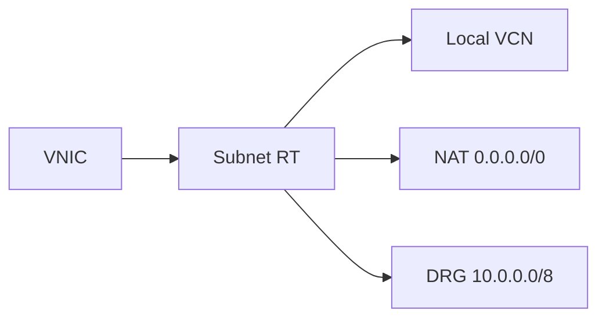

import { ConceptTemplate } from '@/features/kb/components/templates/ConceptTemplate'
import { Callout } from '@/features/kb/components/mdx/Callout'
import { ComparisonTable } from '@/features/kb/components/mdx/ComparisonTable'

export default function Layout({ children }) {
  return (
    <ConceptTemplate title="OCI Route Tables">
      {children}
    </ConceptTemplate>
  )
}

A **route table** in a VCN is a list of destination CIDRs and **network entity** next hops (IGW, NAT, Service Gateway, DRG, LPG, private IP). Each subnet is associated with one route table. Local VCN CIDRs are implicit. This is how public vs private vs hub-spoke actually works.

## 1. Deep Dive and Mechanics

**Association.** Changing a subnet's route table is a live cut. All VNICs in that subnet pick up the new 0.0.0.0/0.

**Longest prefix.** More specific beats default. A 10.0.0.0/8 to the DRG wins over 0.0.0.0/0 to NAT for those destinations.

**Private IP hop.** You can next-hop a firewall appliance ENI/VNIC. Asymmetric routing around that appliance is the classic outage.

**IPv6.** Separate rules when you enable IPv6. Forgetting ::/0 is a half-dual-stack.

<Callout icon="warning" title="One table for all subnets">
If public and private share a table with 0.0.0.0/0 to the IGW, you have designed a trap. Split tables by role.
</Callout>

## 2. Mathematical / Theoretical Foundation

Forwarding is LPM plus implicit local. There is no ECMP in a basic VCN route table the way a DRG can hash. One next hop per prefix.

Blackholes: a route to a detached DRG or a down appliance drops packets. Monitoring should include "unexpected drop at hop."

<ComparisonTable
  headers={['Destination', 'Typical hop', 'Subnet']}
  rows={[
    ['0.0.0.0/0', 'IGW', 'Public'],
    ['0.0.0.0/0', 'NAT', 'Private'],
    ['OCI service CIDR', 'Service Gateway', 'Private'],
    ['On-prem CIDR', 'DRG', 'All that need it'],
  ]}
/>

## 3. Real-World Implementation

```bash
oci network route-table create --compartment-id $COMP --vcn-id $VCN \
  --display-name private \
  --route-rules '[{"cidrBlock":"0.0.0.0/0","networkEntityId":"'"$NAT"'"}]'
```

Associate that table only to private subnets.

## 4. Visualizations



## 5. Interview Prep

**Q: Implicit local routes?**
**A:** Traffic to the VCN CIDR stays in the VCN without a rule you wrote. You still need NSGs.

**Q: Route table vs DRG route table?**
**A:** VCN RT decides how a subnet leaves the VCN. DRG RT decides between attachments. Hub-spoke needs both.

**Q: How do you force traffic through an NVA?**
**A:** More-specific or default routes to the NVA private IP, plus the NVA's own routes and disabled source/dest check as documented.

## 6. Production Use Cases

- Public vs private vs data subnet tables.
- Inspection path to a firewall VNIC.
- Dual-region: on-prem prefixes via DRG, internet via NAT.

<Callout icon="tip" title="Name tables after the hop story">
`rt-private-nat` beats `rt-1`. The next incident responder will thank you.
</Callout>
