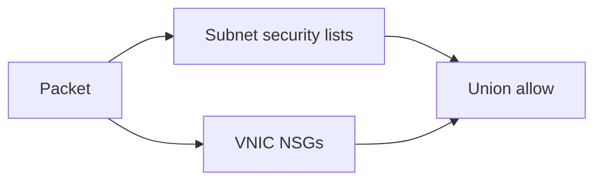

import { ConceptTemplate } from '@/features/kb/components/templates/ConceptTemplate'
import { Callout } from '@/features/kb/components/mdx/Callout'
import { ComparisonTable } from '@/features/kb/components/mdx/ComparisonTable'

export default function Layout({ children }) {
  return (
    <ConceptTemplate title="OCI Security Lists">
      {children}
    </ConceptTemplate>
  )
}

A **security list** is a set of ingress/egress rules attached to a **subnet**. Every VNIC in that subnet is subject to those rules **in addition to** NSGs (union of allows). New VCNs include a default list that is often too open. Stateless rules exist but are rarely what you want.

## 1. Deep Dive and Mechanics

**Stateful default.** Reply packets are tracked. Stateless requires you to write both directions and is used for special high-pps cases.

**Default list.** Historically allowed SSH from the world and wide egress. Treat "default" as hostile until proven.

**Multiple lists.** A subnet can have several lists; allows union. This is how a forgotten list keeps 3389 open.

**Relationship to NSGs.** Prefer NSGs for role-based policy. Keep a minimal list (deny-all or egress-only) so the subnet is not the wildcard.

<Callout icon="error" title="OR semantics">
If the security list allows 0.0.0.0/0:22 and the NSG does not, SSH still works. Tight NSGs cannot save a sloppy list.
</Callout>

## 2. Mathematical / Theoretical Foundation

Effective ingress allow = union(lists, NSGs). No priority number. The widest allow wins in practice.

Stateless + stateful mix on the same path is hard to reason about. Stay stateful unless you measured a need.

<ComparisonTable
  headers={['Tool', 'Scope', 'Use now']}
  rows={[
    ['Security list', 'Subnet', 'Minimal baseline'],
    ['NSG', 'VNIC', 'Real policy'],
    ['AWS NACL', 'Subnet stateless', 'Different model'],
    ['AWS SG', 'ENI stateful', 'Closest to NSG'],
  ]}
/>

## 3. Real-World Implementation

```text
# Default security list: remove 0.0.0.0/0 SSH
# Ingress: none (or DHCP/metadata as required)
# Egress: none if NSGs own egress; else 443 to 0.0.0.0/0 only
```

Apply via Terraform `oci_core_default_security_list` so the next VCN is born locked.

## 4. Visualizations



## 5. Interview Prep

**Q: Why do people still use security lists?**
**A:** Defaults and old tutorials. New designs should be NSG-first.

**Q: Stateful vs stateless list rules?**
**A:** Stateful tracks connections. Stateless is manual both-ways. Default to stateful.

**Q: Can a list reference an NSG?**
**A:** No. NSG-to-NSG referencing is an NSG feature. Lists speak CIDR.

## 6. Production Use Cases

- Locked default list on every new VCN.
- Temporary coarse allow during a migration, then delete.
- Stateless rules only if a documented pps problem requires them.

<Callout icon="tip" title="Audit lists quarterly">
Grep Terraform for `0.0.0.0/0` on security lists. That grep pays for itself.
</Callout>
