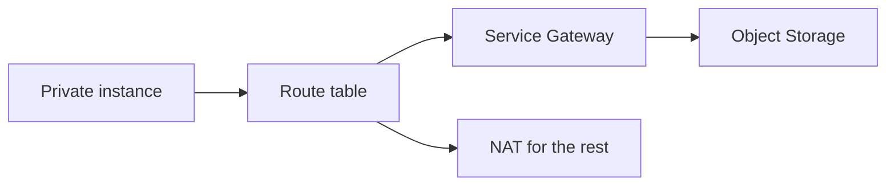

import { ConceptTemplate } from '@/features/kb/components/templates/ConceptTemplate'
import { Callout } from '@/features/kb/components/mdx/Callout'
import { ComparisonTable } from '@/features/kb/components/mdx/ComparisonTable'

export default function Layout({ children }) {
  return (
    <ConceptTemplate title="OCI Service Gateway">
      {children}
    </ConceptTemplate>
  )
}

A **Service Gateway** is a VCN hop that sends traffic to a **service CIDR** (for example the Object Storage CIDR in that region) over Oracle's private backbone. Instances keep private IPs. You do not need NAT or public IPs for those services. IAM still authorizes the API.

## 1. Deep Dive and Mechanics

**Services.** You enable "OCI Object Storage" or "All services in Oracle Services Network" (OSN). Broader is convenient and a larger destination set. Narrow when you can.

**Routes.** A route rule: service CIDR → Service Gateway. Without the route, clients may still try the public IP via NAT.

**NSGs.** Egress to the service CIDR must be allowed. People forget egress.

**On-prem.** Combined with a DRG, on-prem hosts can reach OSN through the VCN if you intended that — or not, if you forgot to filter.

<Callout icon="warning" title="All OSN vs Object Storage only">
"All services" is easy and may expose more endpoints than your threat model wants. Start narrow.
</Callout>

## 2. Mathematical / Theoretical Foundation

Path selection is LPM. If you have both NAT 0.0.0.0/0 and a more specific service CIDR to the SGW, Object Storage stays private. Missing the specific route sends buckets out the NAT.

Data: private path avoids internet egress fees and some compliance "data left the VCN" arguments. It does not bypass IAM.

<ComparisonTable
  headers={['Pattern', 'Cloud', 'Purpose']}
  rows={[
    ['Service Gateway', 'OCI', 'Private OSN'],
    ['Gateway VPC endpoint', 'AWS', 'S3 / Dynamo prefix'],
    ['Private Google Access', 'GCP', 'googleapis private'],
    ['Service endpoint', 'Azure', 'Microsoft service VIP'],
  ]}
/>

## 3. Real-World Implementation

```bash
oci network service-gateway create --compartment-id $COMP --vcn-id $VCN \
  --services '[{"serviceId":"'"$OBJECT_STORAGE_SERVICE_ID"'"}]'

# Route table: destination service CIDR -> service gateway OCID
```

Look up the service OCID with `oci network service list`.

## 4. Visualizations



## 5. Interview Prep

**Q: SGW vs NAT?**
**A:** SGW is only for Oracle service CIDRs. NAT is general internet. Use both on private subnets.

**Q: Does SGW make the bucket private?**
**A:** It makes the **path** private. The bucket can still be public. Lock IAM and public access separately.

**Q: Can on-prem use it?**
**A:** Yes if routed through the VCN/DRG. That can be a feature or an accidental hole.

## 6. Production Use Cases

- Private app subnets writing backups to Object Storage.
- OKE image pulls from OCIR via OSN.
- Data Guard / backups that must not traverse the public internet.

<Callout icon="tip" title="Pair with a bucket policy">
Private path plus a public bucket is still a public bucket. Close both doors.
</Callout>
