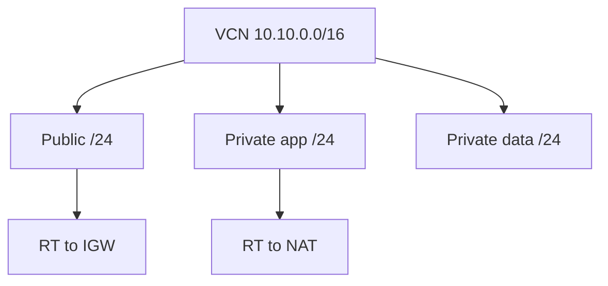

import { ConceptTemplate } from '@/features/kb/components/templates/ConceptTemplate'
import { Callout } from '@/features/kb/components/mdx/Callout'
import { ComparisonTable } from '@/features/kb/components/mdx/ComparisonTable'

export default function Layout({ children }) {
  return (
    <ConceptTemplate title="OCI Subnets">
      {children}
    </ConceptTemplate>
  )
}

A **subnet** is a CIDR carved from a VCN. **Regional subnets** span all ADs in the region (the default you want). **AD-specific** subnets are the older model. Public vs private is a flag plus routing: public subnets allow public IPs; private forbid them.

## 1. Deep Dive and Mechanics

**Public flag.** `prohibitPublicIpOnVnic=true` (private) stops accidental public IPs. Route tables still need to be correct.

**IPs.** Each VNIC consumes an address. OKE VCN-native pods may consume many. Reserve space.

**DNS.** VCN resolver plus optional custom DNS. Instance FQDNs depend on subnet DNS label.

**Features.** DHCP options, IPv6 prefixes, and the associated route table + security lists are subnet properties. NSGs are not.

<Callout icon="warning" title="Tiny subnets and OKE">
A /28 looks tidy and dies when the load balancer and pods arrive. Plan /24 or larger for node/pod subnets unless you measured.
</Callout>

## 2. Mathematical / Theoretical Foundation

Usable IPs are CIDR size minus Oracle-reserved addresses (a handful per subnet). Spreadsheet that.

Regional subnet: placement of instances still picks an AD, but the CIDR is not AD-locked. That simplifies HA.

<ComparisonTable
  headers={['Subnet style', 'Scope', 'Use']}
  rows={[
    ['Regional', 'All ADs', 'Default'],
    ['AD-specific', 'One AD', 'Legacy'],
    ['Public', 'Public IPs allowed', 'LB / bastion'],
    ['Private', 'No public IPs', 'Apps / data'],
  ]}
/>

## 3. Real-World Implementation

```bash
oci network subnet create --compartment-id $COMP --vcn-id $VCN \
  --cidr-block 10.10.1.0/24 --display-name private-app \
  --prohibit-public-ip-on-vnic true \
  --route-table-id $RT_PRIV --security-list-ids '["'"$SL"'"]'
```

Attach NSGs at VNIC create time, not as an afterthought.

## 4. Visualizations



## 5. Interview Prep

**Q: Regional vs AD subnet?**
**A:** Regional is simpler HA. AD-specific is leftover. New VCNs should be regional.

**Q: What makes a subnet private?**
**A:** No public IPs plus a route table that does not require IGW for instances. The flag enforces the first part.

**Q: How many subnets?**
**A:** Enough for blast radius (public, app, data) not one per VM.

## 6. Production Use Cases

- Three-tier CIDR plan with room to grow.
- Separate subnet for mount targets and DB private endpoints.
- Dedicated public /28 for LBs only.

<Callout icon="tip" title="Draw CIDRs before Terraform">
Overlapping with on-prem or another VCN you will peer is a migration. IPAM first.
</Callout>
