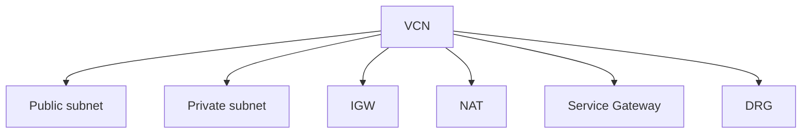

import { ConceptTemplate } from '@/features/kb/components/templates/ConceptTemplate'
import { Callout } from '@/features/kb/components/mdx/Callout'
import { ComparisonTable } from '@/features/kb/components/mdx/ComparisonTable'

export default function Layout({ children }) {
  return (
    <ConceptTemplate title="OCI Virtual Cloud Network">
      {children}
    </ConceptTemplate>
  )
}

A **VCN** is a regional software-defined network. You assign one or more CIDRs, then add **subnets**, **gateways** (IGW, NAT, Service, DRG), **route tables**, and **security lists / NSGs**. Most resources with a VNIC attach here. It is the AWS VPC analog, regional like AWS, not global like GCP.

## 1. Deep Dive and Mechanics

**CIDRs.** IPv4 blocks you can expand later if adjacent space is free. Overlap with on-prem or peered VCNs blocks routing.

**Gateways.** IGW (internet), NAT (private egress), Service Gateway (OSN), DRG (hybrid/hub), LPG (local VCN peer). Each is a next hop, not a subnet.

**DNS.** Enable VCN resolver. Instance hostnames work if subnet DNS labels exist.

**Peering.** LPG is 1:1 local. DRG is hub. Remote peering joins regions. Transitive routing needs the DRG design, not stacked LPGs.

<Callout icon="warning" title="One giant VCN vs many">
One VCN is simple IPAM. Many VCNs isolate blast radius and billing units. Hub-spoke with a DRG is the usual enterprise answer, not 40 LPGs.
</Callout>

## 2. Mathematical / Theoretical Foundation

Address space is a packing problem against on-prem and other clouds. A 10.0.0.0/8 VCN is rude if you will ever peer.

Packet path: VNIC → NSG/list → LPM route → gateway. Failures are usually the middle two.

<ComparisonTable
  headers={['Network', 'Scope', 'Peer style']}
  rows={[
    ['VCN', 'Regional', 'LPG / DRG'],
    ['AWS VPC', 'Regional', 'TGW / peering'],
    ['GCP VPC', 'Global', 'Peering / NCC'],
    ['Azure VNet', 'Regional', 'Peering / vWAN'],
  ]}
/>

## 3. Real-World Implementation

```bash
oci network vcn create --compartment-id $NET \
  --cidr-blocks '["10.20.0.0/16"]' --display-name prod \
  --dns-label prod
```

Then add regional subnets, IGW/NAT/SGW, and split route tables before the first instance.

## 4. Visualizations



## 5. Interview Prep

**Q: VCN vs subnet vs NSG?**
**A:** VCN is the network. Subnet is a CIDR + route table. NSG is the VNIC firewall.

**Q: How do two VCNs talk?**
**A:** LPG if simple and same region. DRG if hub-spoke or hybrid.

**Q: Is a VCN global?**
**A:** No. Regional. Cross-region is remote peering or public, not implicit.

## 6. Production Use Cases

- Landing-zone hub VCN plus spoke VCNs per environment.
- Isolated sandbox VCN with no DRG.
- Dual-CIDR VCN when you must merge overlapping teams (painful; avoid).

<Callout icon="tip" title="Create the VCN in a network compartment">
App teams `use` subnets. They do not `manage` the VCN. That policy split is the whole landing zone.
</Callout>
