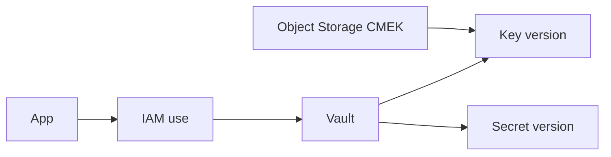

import { ConceptTemplate } from '@/features/kb/components/templates/ConceptTemplate'
import { Callout } from '@/features/kb/components/mdx/Callout'
import { ComparisonTable } from '@/features/kb/components/mdx/ComparisonTable'

export default function Layout({ children }) {
  return (
    <ConceptTemplate title="OCI Vault">
      {children}
    </ConceptTemplate>
  )
}

**OCI Vault** (KMS) holds **encryption keys**, **secrets**, and optionally **certificates**. Virtual private vaults offer dedicated HSM partitions; default vaults are multi-tenant HSM-backed. Apps decrypt or fetch secret versions via IAM, not by reading a file from Object Storage you called "secure."

## 1. Deep Dive and Mechanics

**Keys.** AES/RSA keys with versions. Soft delete has a waiting period. Services (Object Storage, Block, ADB) can use CMEK by pointing at a key OCID.

**Secrets.** Base64 payloads with versions. Rotation is a new version plus consumers that pin or follow latest on purpose.

**Access.** Policies on `key-family` and `secret-family` in the vault's compartment. Dynamic groups for compute. Management vs use are different verbs.

**Replication.** Cross-region key/secret replication exists for DR. Test decrypt in the DR region before the outage.

<Callout icon="error" title="Secrets in userdata">
cloud-init that echoes a password is world-readable on the instance metadata path you forgot. Fetch from Vault at boot.
</Callout>

## 2. Mathematical / Theoretical Foundation

Key use vs manage: a compromised app should `use` keys (encrypt/decrypt) not `manage` (schedule deletion). Split policies.

FIPS/HSM story is why regulated shops pick a private vault. It costs more; it is not faster crypto for a blog app.

<ComparisonTable
  headers={['Store', 'Holds', 'Cloud analog']}
  rows={[
    ['Vault keys', 'CMEK / crypto', 'KMS / Cloud KMS'],
    ['Vault secrets', 'Payload versions', 'Secrets Manager'],
    ['Certificates', 'TLS material', 'ACM / Cert Manager'],
    ['Config files', 'Non-secrets', 'Not Vault'],
  ]}
/>

## 3. Real-World Implementation

```python
import oci
signer = oci.auth.signers.InstancePrincipalsSecurityTokenSigner()
client = oci.secrets.SecretsClient(config={}, signer=signer)
bundle = client.get_secret_bundle(secret_id="ocid1.vaultsecret...")
# decode bundle.secret_bundle_content
```

Grant `read secret-family` (or the tighter secret-specific statement) to the dynamic group only.

## 4. Visualizations



## 5. Interview Prep

**Q: Vault vs writing secrets in Object Storage?**
**A:** Vault has versions, IAM verbs for use vs manage, and audit. A "private" bucket is still a bucket.

**Q: What is CMEK?**
**A:** You supply the wrapping key. Oracle still stores the data. Deleting the key is how you cryptoshred (after the waiting period).

**Q: Virtual private vault?**
**A:** Dedicated HSM partition for isolation/compliance. Default vault is fine for many workloads.

## 6. Production Use Cases

- CMEK on backup buckets and block volumes.
- DB passwords fetched by instance principals at start.
- TLS certs issued or stored for the load balancer.

<Callout icon="tip" title="Pin secret versions in prod">
`latest` during a rotation can mix old and new mid-fleet. Pin, roll, then move latest.
</Callout>
