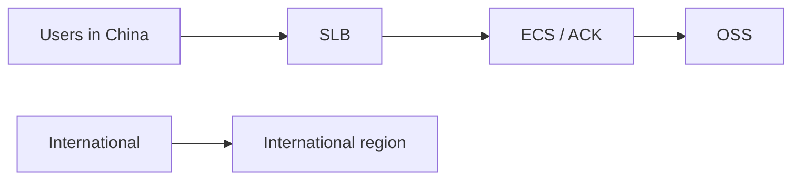

import { ConceptTemplate } from '@/features/kb/components/templates/ConceptTemplate'
import { Callout } from '@/features/kb/components/mdx/Callout'
import { ComparisonTable } from '@/features/kb/components/mdx/ComparisonTable'

export default function Layout({ children }) {
  return (
    <ConceptTemplate title="Alibaba Cloud">
      {children}
    </ConceptTemplate>
  )
}

**Alibaba Cloud** (Aliyun) is a hyperscaler with deepest capacity in **China** and strong APAC coverage. The product map rhymes with AWS: **ECS** (VMs), **OSS** (objects), **VPC**, **ACK** (Kubernetes), **SLB**, **RDS**, **Function Compute**. Compliance, ICP filings, and account residency are first-class constraints, not footnotes.

## 1. Deep Dive and Mechanics

**China vs international.** Mainland regions sit behind different connectivity and regulatory rules. A Singapore account is not a Shanghai account. Cross-border links have latency and legal cost.

**RAM.** Resource Access Management is the IAM analog: users, roles, policies. STS tokens for workloads. RAM and STS mistakes are the usual breach.

**Networking.** VPC + vSwitch (AZ-scoped). CEN for multi-region. Express Connect for hybrid. Public IPs and EIP quotas are tight in some regions.

**Data.** OSS classes, PolarDB, MaxCompute, and DataWorks show up in enterprise stacks. Do not assume S3 SDK defaults without the OSS endpoint.

<Callout icon="warning" title="ICP and public HTTP">
A public website on a mainland region generally needs an ICP filing. Ignoring this is not a DNS problem; it is a compliance block.
</Callout>

## 2. Mathematical / Theoretical Foundation

Multi-cloud active-active between AWS and Aliyun is a latency plus consistency problem, not a Terraform provider problem. Usually you pick a primary cloud per user geo.

Egress and cross-border bandwidth dominate bills when you treat China as "another AZ."

<ComparisonTable
  headers={['Need', 'Alibaba', 'AWS analog']}
  rows={[
    ['VM', 'ECS', 'EC2'],
    ['Object', 'OSS', 'S3'],
    ['K8s', 'ACK', 'EKS'],
    ['IAM', 'RAM', 'IAM'],
  ]}
/>

## 3. Real-World Implementation

```bash
aliyun ecs DescribeInstances --RegionId cn-hangzhou
# Terraform: alicloud provider, ram roles, vpc + vswitch per AZ
```

Pin region ids (`cn-hangzhou` vs `ap-southeast-1`). They are not interchangeable.

## 4. Visualizations



## 5. Interview Prep

**Q: Why Aliyun instead of AWS Beijing?**
**A:** Local ops, product coverage, and sometimes procurement. AWS also has China (operated with partners). Pick from data residency and team skill, not brand.

**Q: What is RAM?**
**A:** Aliyun IAM. Roles for ECS, policies on OSS. Same least-privilege story.

**Q: Can I use one global control plane?**
**A:** Not honestly. Mainland is a different operational domain.

## 6. Production Use Cases

- Consumer apps whose users are in mainland China.
- APAC enterprises already on Alibaba Group ecosystem.
- Hybrid with on-prem China DCs via Express Connect.

<Callout icon="tip" title="Separate accounts per realm">
Do not mix mainland production and international sandbox identity. Billing and RAM blast radius stay cleaner.
</Callout>
