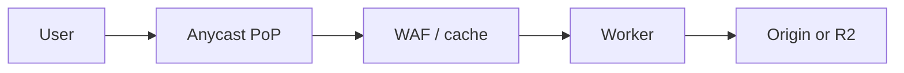

import { ConceptTemplate } from '@/features/kb/components/templates/ConceptTemplate'
import { Callout } from '@/features/kb/components/mdx/Callout'
import { ComparisonTable } from '@/features/kb/components/mdx/ComparisonTable'

export default function Layout({ children }) {
  return (
    <ConceptTemplate title="Cloudflare">
      {children}
    </ConceptTemplate>
  )
}

**Cloudflare** operates a global anycast edge. Orange-cloud DNS sends HTTP through that edge for DDoS, WAF, CDN, and TLS. **Workers** run isolate-based functions at PoPs. **R2** is S3-shaped object storage with no egress fees to the internet (the pitch). Tunnel and Zero Trust replace a chunk of VPN.

## 1. Deep Dive and Mechanics

**Proxy vs DNS-only.** Proxied records hide origin IP. DNS-only is gray cloud and exposes origin. Mixed records are how people leak the origin anyway (mail, direct IP, leftover A records).

**Workers.** V8 isolates, not containers. CPU time and subrequest limits are tight. Durable Objects add coordination. Pages and Workers Sites host frontends.

**R2 and KV.** R2 for blobs; KV for eventually-consistent edge config; D1 for SQLite-ish. Consistency models differ. Do not treat KV as a strongly consistent user table.

**Zero Trust.** Access in front of apps, device posture, and Tunnel so the origin has no public IP.

<Callout icon="warning" title="Origin IP leaks">
If the origin still has a public IP and a forgotten A record, attackers bypass WAF. Lock origin to Cloudflare IPs or use Tunnel.
</Callout>

## 2. Mathematical / Theoretical Foundation

Anycast: users hit the nearest PoP. Failover is withdraw/announce, not a 60s TTL. Cache hit ratio is the CDN cost function.

Workers billed on CPU time and requests. A tight loop is a finance event. KV reads are cheap; writes are not a hot-path counter.

<ComparisonTable
  headers={['Piece', 'Cloudflare', 'Hyperscaler analog']}
  rows={[
    ['Edge proxy', 'CDN + WAF', 'CloudFront + WAF'],
    ['Compute', 'Workers', 'Lambda@Edge / Cloud Run'],
    ['Objects', 'R2', 'S3 / GCS'],
    ['Private origin', 'Tunnel', 'PrivateLink + VPN'],
  ]}
/>

## 3. Real-World Implementation

```javascript
export default {
  async fetch(request, env) {
    const cache = caches.default;
    const hit = await cache.match(request);
    if (hit) return hit;
    const res = await fetch(request);
    return res;
  },
};
```

Pair with a WAF rule set and an origin allow list.

## 4. Visualizations



## 5. Interview Prep

**Q: Is Cloudflare a cloud?**
**A:** It is an edge and security platform with compute and storage. It is not a VM catalog. Many architectures are Cloudflare plus one hyperscaler.

**Q: Workers vs Lambda?**
**A:** Isolates at 300+ PoPs, no cold VM in the same sense, tighter CPU limits. Lambda is a region and a richer VPC story.

**Q: R2 vs S3?**
**A:** S3-compatible API, different consistency/ops, egress pricing is the commercial hook. Features are not 1:1.

## 6. Production Use Cases

- Public websites that need DDoS headroom.
- API edge auth and bot management.
- Zero Trust to internal apps without a fat VPN.

<Callout icon="tip" title="Treat Terraform as source of truth">
WAF exceptions added in the dashboard during an incident never get removed. Codify rules.
</Callout>
