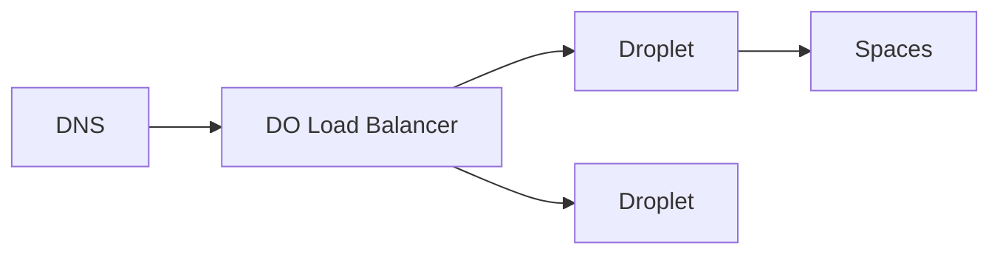

import { ConceptTemplate } from '@/features/kb/components/templates/ConceptTemplate'
import { Callout } from '@/features/kb/components/mdx/Callout'
import { ComparisonTable } from '@/features/kb/components/mdx/ComparisonTable'

export default function Layout({ children }) {
  return (
    <ConceptTemplate title="DigitalOcean">
      {children}
    </ConceptTemplate>
  )
}

**DigitalOcean** sells straightforward cloud: **Droplets** (VMs), volumes, **Spaces** (S3-compatible), Load Balancers, and **DOKS** (managed Kubernetes). The UI and API optimize for indie and SMB speed. You get fewer IAM hierarchies, fewer regions, and a bill you can explain.

## 1. Deep Dive and Mechanics

**Droplets.** Fixed sizes, images, VPC, optional reserved IP. Snapshots and backups are explicit products. No fifteen-page IAM policy on day one — also fewer guardrails.

**DOKS.** Managed control plane, node pools, and DO load balancer integration. Fine until you need a hyperscaler-only addon.

**App Platform.** PaaS-like builds from git. Closer to Render/Heroku than to raw Droplets.

**Spaces + CDN.** Object storage with a built-in CDN option. Compatibility is S3-ish.

<Callout icon="warning" title="Team tokens">
A single API token with write on the account is common and painful when it leaks. Use scoped tokens and SSO if you have it.
</Callout>

## 2. Mathematical / Theoretical Foundation

Price is mostly linear in Droplet hours and bandwidth overage. The simplicity is the product: you cannot hide spend in 40 line items as easily — or get Reserved Instance math.

HA: regions are fewer. Multi-AZ stories are thinner than AWS. Design DR as a second region or another cloud.

<ComparisonTable
  headers={['Need', 'DigitalOcean', 'Hyperscaler']}
  rows={[
    ['VM', 'Droplet', 'EC2 / GCE'],
    ['K8s', 'DOKS', 'EKS / GKE'],
    ['Object', 'Spaces', 'S3'],
    ['PaaS', 'App Platform', 'Elastic Beanstalk / Run'],
  ]}
/>

## 3. Real-World Implementation

```bash
doctl compute droplet create web-1 --region nyc3 --size s-2vcpu-4gb \
  --image ubuntu-24-04-x64 --vpc-uuid $VPC
```

Put Droplets in a VPC from the start. Public-only networking is the default trap.

## 4. Visualizations



## 5. Interview Prep

**Q: When is DO the right cloud?**
**A:** Small teams, predictable apps, cost transparency. Not when you need a 200-service landing zone or a specific AWS SKU.

**Q: Droplet vs App Platform?**
**A:** Droplet if you want SSH and images. App Platform if you want git-push.

**Q: Is Spaces S3?**
**A:** Compatible enough for many SDKs. IAM and feature flags differ.

## 6. Production Use Cases

- SaaS MVPs and agencies that outgrew a single VPS.
- DOKS for teams that want Kubernetes without EKS ceremony.
- Spaces for user uploads with CDN.

<Callout icon="tip" title="Turn on VPC and firewalls immediately">
A fresh Droplet on 0.0.0.0/0:22 is a scanner target. Cloud Firewalls are not optional hygiene.
</Callout>
