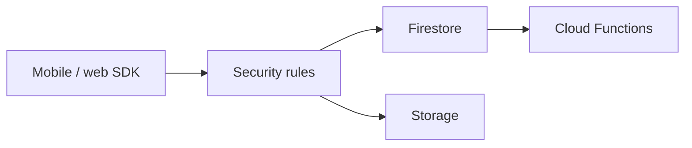

import { ConceptTemplate } from '@/features/kb/components/templates/ConceptTemplate'
import { Callout } from '@/features/kb/components/mdx/Callout'
import { ComparisonTable } from '@/features/kb/components/mdx/ComparisonTable'

export default function Layout({ children }) {
  return (
    <ConceptTemplate title="Firebase">
      {children}
    </ConceptTemplate>
  )
}

**Firebase** is a BaaS on GCP: **Authentication**, **Firestore** or Realtime Database, **Cloud Functions**, **Hosting**, Cloud Messaging, Remote Config, and Crashlytics. Clients talk to Firebase with security rules. Under the hood many services are GCP (IAM, GCS, Functions). The product is the client SDK and rules language.

## 1. Deep Dive and Mechanics

**Auth.** Email, social, and anonymous. Tokens flow to rules as `request.auth`. Miswritten rules are a public database.

**Data.** Firestore for documents and listeners. Realtime Database is the older JSON tree. Storage is GCS with rules.

**Functions.** Triggers on HTTPS, Firestore writes, Auth events. They run as GCP Cloud Functions with a Firebase deploy UX.

**Projects.** A Firebase project is a GCP project with extras. You can break out to raw GCP when you outgrow the console.

<Callout icon="error" title="Open rules in production">
`allow read, write: if true` is the tutorial default people forget to change. That is a data breach, not a misconfig ticket.
</Callout>

## 2. Mathematical / Theoretical Foundation

Billing is reads/writes/deletes plus Functions time plus bandwidth. A chatty listener on a hot document is a read amplifier.

Security rules are a server-side program. Complexity explodes; test them. They are not a substitute for a real authZ model once you have admin tools.

<ComparisonTable
  headers={['Need', 'Firebase', 'Escape hatch']}
  rows={[
    ['Auth', 'Firebase Auth', 'Identity Platform / custom'],
    ['DB', 'Firestore', 'Cloud SQL / Spanner'],
    ['Files', 'Storage', 'GCS directly'],
    ['Server', 'Functions', 'Cloud Run'],
  ]}
/>

## 3. Real-World Implementation

```javascript
rules_version = '2';
service cloud.firestore {
  match /databases/{db}/documents {
    match /users/{uid} {
      allow read, write: if request.auth != null && request.auth.uid == uid;
    }
  }
}
```

Never ship the open tutorial rules. Add emulator tests for rules.

## 4. Visualizations



## 5. Interview Prep

**Q: Firebase vs raw GCP?**
**A:** Firebase is the client-centric product. GCP is the infrastructure. Successful apps often start Firebase and move admin paths to Cloud Run.

**Q: Firestore vs RTDB?**
**A:** Firestore for new apps. RTDB only if you are stuck on it.

**Q: What fails at scale?**
**A:** Hot documents, unbounded listeners, and rules that require extra reads (those extra reads bill).

## 6. Production Use Cases

- Consumer mobile apps with presence and offline cache.
- Prototype backends that must ship this week.
- FCM push plus Auth as a slice of a larger GCP system.

<Callout icon="tip" title="Put admin behind a server">
Privileged writes should be Functions or Cloud Run with Admin SDK, not a hidden client collection with wishful rules.
</Callout>
