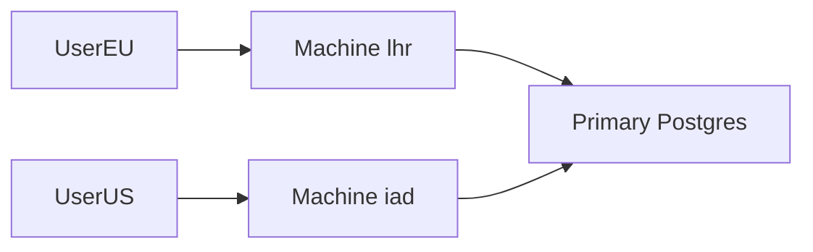

import { ConceptTemplate } from '@/features/kb/components/templates/ConceptTemplate'
import { Callout } from '@/features/kb/components/mdx/Callout'
import { ComparisonTable } from '@/features/kb/components/mdx/ComparisonTable'

export default function Layout({ children }) {
  return (
    <ConceptTemplate title="Fly.io">
      {children}
    </ConceptTemplate>
  )
}

**Fly.io** deploys **Machines** (Firecracker-style VMs running your container) in many regions and fronts them with anycast. You place replicas near users. Volumes are regional. Postgres and LiteFS are the usual data stories. It feels like a PaaS with extra geography.

## 1. Deep Dive and Mechanics

**Machines.** Start/stop quickly. Scale-to-zero is possible. `fly.toml` defines services, ports, and concurrency.

**Networking.** Anycast IPv4/IPv6, private WireGuard (6PN) between apps. Flycast for internal load balancing.

**Data.** Volumes do not magically replicate across regions. LiteFS or a primary Postgres plus replicas is your consistency model. Redis and Tigris/object options appear in the catalog.

**GPUs and hardware.** Fly also rents specialty Machines. Read availability per region.

<Callout icon="warning" title="Volumes are sticky">
A Machine with a volume is pinned. You cannot anycast writes to a single SQLite volume in three cities without a replication story.
</Callout>

## 2. Mathematical / Theoretical Foundation

Placement: latency to user vs latency to primary DB. Edge compute with a far-away primary can be slower than one region. Replay or local reads only if you designed them.

Billing is Machine time plus bandwidth plus volumes. Idle Machines you forgot to stop look like Droplets.

<ComparisonTable
  headers={['Need', 'Fly', 'Alternative']}
  rows={[
    ['Global HTTP', 'Anycast Machines', 'Cloudflare + origin'],
    ['Containers', 'Machines', 'Cloud Run / ECS'],
    ['SQLite edge', 'LiteFS', 'Single-region Postgres'],
    ['Simple PaaS', 'fly.toml', 'Render / Railway'],
  ]}
/>

## 3. Real-World Implementation

```toml
# fly.toml (sketch)
app = "api"
primary_region = "iad"

[http_service]
  internal_port = 8080
  force_https = true
```

```bash
fly deploy
fly scale count 2 --region iad
fly scale count 1 --region lhr
```

Put the primary DB in `iad` if that is where writes live.

## 4. Visualizations



## 5. Interview Prep

**Q: Fly vs Cloudflare Workers?**
**A:** Fly runs your container (full runtime, disks). Workers are isolates with tight limits. Different compute model.

**Q: Fly vs a hyperscaler region?**
**A:** Fly is for putting small fleets in many cities. Heavy data gravity still wants a hyperscaler or one primary region.

**Q: How do you do HA?**
**A:** Multiple Machines in a region plus a data plane that can fail over. One Machine plus a volume is a pet.

## 6. Production Use Cases

- Latency-sensitive HTTP APIs with a regional primary DB.
- LiteFS-backed apps that can live with replica lag.
- Side projects that outgrew a single VPS but not AWS.

<Callout icon="tip" title="Measure TTFB from more than one city">
Anycast plus a distant database can erase the edge win. Synthetic checks from EU and US before you celebrate.
</Callout>
