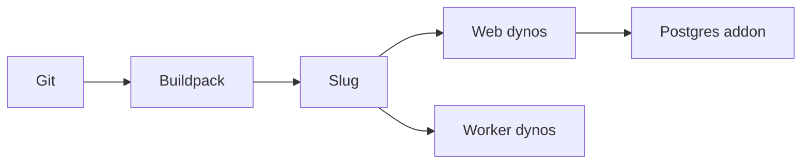

import { ConceptTemplate } from '@/features/kb/components/templates/ConceptTemplate'
import { Callout } from '@/features/kb/components/mdx/Callout'
import { ComparisonTable } from '@/features/kb/components/mdx/ComparisonTable'

export default function Layout({ children }) {
  return (
    <ConceptTemplate title="Heroku">
      {children}
    </ConceptTemplate>
  )
}

**Heroku** popularized twelve-factor PaaS: `git push heroku main`, **buildpacks**, **dynos**, a router, and **addons** (Postgres, Redis) via a marketplace. Salesforce owns it. The developer experience is still the reference. Price per dyno-hour at scale is why many teams leave.

## 1. Deep Dive and Mechanics

**Dynos.** Isolated containers with a process type (`web`, `worker`). Horizontal scale is dyno count. Ephemeral filesystem. Config vars are the config store.

**Buildpacks.** Detect language, produce a slug. Custom buildpacks exist. Docker deploys are the escape from buildpack magic.

**Addons.** Resources provisioned into the app with a URL in the environment. Classic lock-in: the addon API is easy, leaving is a dump and a DNS cut.

**Spaces / Private.** Network-isolated dynos for enterprise. Costs more, closer to a VPC story.

<Callout icon="warning" title="Slug and stack drift">
Heroku stacks (base OS) retire. An unmaintained app dies on a stack EOL, not on a code bug. Watch the stack.
</Callout>

## 2. Mathematical / Theoretical Foundation

Cost ≈ dyno-hours × size + addon tiers + data. A 24/7 `standard-2x` web plus worker plus PG can exceed a reserved VM you would have to operate.

Concurrency: one dyno handles N connections. The router times out (30s classic). Long requests need a worker, not a bigger web dyno.

<ComparisonTable
  headers={['Heroku idea', 'Meaning', 'Elsewhere']}
  rows={[
    ['Dyno', 'Process container', 'Cloud Run instance'],
    ['Buildpack', 'Build the slug', 'Dockerfile'],
    ['Addon', 'Attached service', 'Marketplace + URI'],
    ['Procfile', 'Process types', 'systemd units'],
  ]}
/>

## 3. Real-World Implementation

```text
# Procfile
web: node server.js
worker: node worker.js
```

```bash
heroku create
git push heroku main
heroku ps:scale web=2 worker=1
```

Use release-phase tasks for migrations, not "run migrate on the first web dyno."

## 4. Visualizations



## 5. Interview Prep

**Q: Why was Heroku important?**
**A:** It taught twelve-factor and git-push. Most PaaS products are answers to Heroku.

**Q: Why leave?**
**A:** Cost, region limits, and need for sidecars or custom networking. Teams often move to containers on a hyperscaler and miss the UX.

**Q: Ephemeral disk?**
**A:** Dyno restart wipes local files. Store in S3/Spaces or the addon DB.

## 6. Production Use Cases

- Product teams that should not own Kubernetes yet.
- Review apps per pull request.
- Marketplace addons for a complete but small stack.

<Callout icon="tip" title="Release phase for schema">
If two web dynos boot and both migrate, you race. One release command is the contract.
</Callout>
