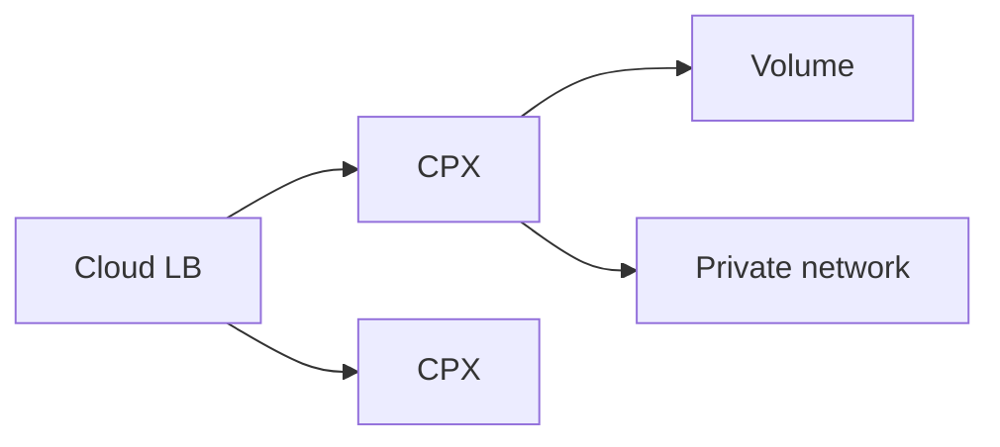

import { ConceptTemplate } from '@/features/kb/components/templates/ConceptTemplate'
import { Callout } from '@/features/kb/components/mdx/Callout'
import { ComparisonTable } from '@/features/kb/components/mdx/ComparisonTable'

export default function Layout({ children }) {
  return (
    <ConceptTemplate title="Hetzner Cloud">
      {children}
    </ConceptTemplate>
  )
}

**Hetzner Cloud** is a German IaaS provider known for **low EUR prices** and solid VMs (CX shared, CPX dedicated AMD, CCX dedicated). You get locations (Falkenstein, Nuremberg, Helsinki, Ashburn, Hillsboro, Singapore, and growing), private networks, load balancers, and object storage — not a clone of AWS's SKU encyclopedia.

## 1. Deep Dive and Mechanics

**Servers.** Cloud-init, images, snapshots, rescue. Dedicated vCPU SKUs matter for noisy-neighbor-sensitive apps.

**Network.** Public IPv4 is scarce and priced. Private networks plus vSwitch-style isolation. Cloud Firewalls are stateful groups.

**Load balancer and volumes.** Enough for a small HA pair. Do not expect 15 flavors of L7 policy.

**Robot vs Cloud.** Classic dedicated Robot servers are a different product. People mix the names.

<Callout icon="warning" title="You are the platform team">
No managed IAM folders, no org-wide SCP analog. A leaked API token is the project. Design your own bastion, backup, and IdP.
</Callout>

## 2. Mathematical / Theoretical Foundation

Price/performance is the reason to be here. The trade is ops: Kubernetes, IAM, and compliance frameworks are yours (or k3s on three boxes).

Egress and IPv4 cost still exist. "Cheap VMs" plus huge egress to users can surprise.

<ComparisonTable
  headers={['Need', 'Hetzner', 'DO / AWS']}
  rows={[
    ['VM', 'CX / CPX / CCX', 'Droplet / EC2'],
    ['K8s', 'You or partners', 'DOKS / EKS'],
    ['Object', 'Object Storage', 'Spaces / S3'],
    ['Price story', 'Aggressive EUR', 'More SKUs'],
  ]}
/>

## 3. Real-World Implementation

```bash
hcloud server create --name web-1 --type cpx31 --image ubuntu-24.04 \
  --location fsn1 --network $NET --firewall $FW
```

Terraform `hcloud` provider should own servers, networks, and firewalls.

## 4. Visualizations



## 5. Interview Prep

**Q: Why Hetzner in interviews?**
**A:** Cost, EU locations, and "we run our own platform." Contrast with shared-responsibility on AWS.

**Q: Cloud vs dedicated?**
**A:** Cloud is API VMs. Dedicated Robot is rented hardware. Different SLA and provisioning.

**Q: Is it 'the cloud'?**
**A:** Yes, IaaS. It is not a full PaaS/IAM/analytics suite.

## 6. Production Use Cases

- EU-hosted SaaS that wants predictable compute cost.
- GitLab / CI runners that burn CPU.
- Homelab-grade HA that grew into production (with backups this time).

<Callout icon="tip" title="Snapshots are not offsite backups">
Copy images or dumps to another location or provider. One DC plus snapshots in the same account is one invoice incident away.
</Callout>
