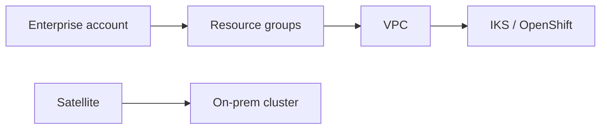

import { ConceptTemplate } from '@/features/kb/components/templates/ConceptTemplate'
import { Callout } from '@/features/kb/components/mdx/Callout'
import { ComparisonTable } from '@/features/kb/components/mdx/ComparisonTable'

export default function Layout({ children }) {
  return (
    <ConceptTemplate title="IBM Cloud">
      {children}
    </ConceptTemplate>
  )
}

**IBM Cloud** is an enterprise-focused public cloud. Modern workloads sit on **VPC** (gen2): VSIs, block storage, load balancers, and **IKS** or **Red Hat OpenShift**. **Cloud Functions** is FaaS. Older **Classic** infrastructure still exists. IBM also sells **Power** and z-adjacent capacity, plus **watsonx** for AI. Procurement and hybrid (Satellite) are part of the product.

## 1. Deep Dive and Mechanics

**IAM.** Accounts, resource groups, access groups, and fine-grained IAM. Enterprise account hierarchy exists. It is closer to "enterprise directory" than to a hobby token.

**VPC vs Classic.** New designs should be VPC. Classic has different networking and a long tail of apps.

**OpenShift.** IBM's Kubernetes story is often ROSA-like OpenShift they operate. IKS is vanilla-er Kubernetes.

**Satellite.** Run IBM Cloud services on your hardware or another cloud — hybrid control plane.

<Callout icon="warning" title="Classic gravity">
A ten-year IBM account may still have Classic VLANs. Mixing Classic and VPC without a plan is a network incident.
</Callout>

## 2. Mathematical / Theoretical Foundation

Hybrid latency: Satellite or Direct Link does not make two continents one AZ. Place data next to the Power box if that is the system of record.

Cost is contract-shaped (committed spend) more often than on-demand sticker.

<ComparisonTable
  headers={['Need', 'IBM Cloud', 'Elsewhere']}
  rows={[
    ['VM', 'VSI in VPC', 'EC2'],
    ['K8s', 'IKS / OpenShift', 'EKS / ROSA'],
    ['FaaS', 'Cloud Functions', 'Lambda'],
    ['Hybrid', 'Satellite', 'Outposts / Anthos'],
  ]}
/>

## 3. Real-World Implementation

```bash
ibmcloud login
ibmcloud is instances
ibmcloud ks clusters
```

Resource groups should match environments. Do not dump everything into default.

## 4. Visualizations



## 5. Interview Prep

**Q: Why IBM Cloud?**
**A:** Existing IBM/Red Hat estate, regulated industries, Power/z adjacency, or an enterprise agreement. Rarely "we wanted the cheapest VM."

**Q: IKS vs OpenShift?**
**A:** IKS is managed Kubernetes. OpenShift adds operators, routes, and a different support story. IBM leans OpenShift.

**Q: What is Classic?**
**A:** The pre-VPC generation. Know it exists so you do not debug the wrong API.

## 6. Production Use Cases

- Banks and insurers already on IBM software.
- OpenShift as the corporate platform, IBM as the host.
- watsonx projects that must stay in IBM's IAM boundary.

<Callout icon="tip" title="Start from resource groups and IAM">
The first week should not be a VSI in default. Landing zone first, same as any enterprise cloud.
</Callout>
