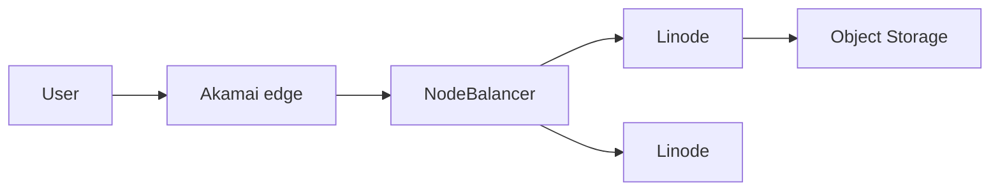

import { ConceptTemplate } from '@/features/kb/components/templates/ConceptTemplate'
import { Callout } from '@/features/kb/components/mdx/Callout'
import { ComparisonTable } from '@/features/kb/components/mdx/ComparisonTable'

export default function Layout({ children }) {
  return (
    <ConceptTemplate title="Linode / Akamai Cloud">
      {children}
    </ConceptTemplate>
  )
}

**Linode** is a long-running developer IaaS now branded **Akamai Cloud Computing**. You still get **Linodes** (VMs), volumes, NodeBalancers, **LKE** (Kubernetes), and Object Storage. Akamai adds a global CDN/security edge. The interesting architecture is origin on Linode plus delivery on Akamai — if you wire them on purpose.

## 1. Deep Dive and Mechanics

**Linodes.** Shared vs dedicated CPU, GPUs in some sites, images, StackScripts (cloud-init cousins). Regions are the classic Linode list plus growth.

**LKE.** Managed K8s with Linode CCM for NodeBalancers and volumes. Simple and adequate.

**Object Storage.** S3-compatible. Good for backups and static assets; pair with Akamai property for public delivery.

**Akamai edge.** Property Manager, WAF, and Ion are a different console and contract. Do not assume a checkbox connects them.

<Callout icon="warning" title="Two control planes">
Linode API tokens do not configure Akamai properties. Identity and billing may still feel like two vendors. Plan the seam.
</Callout>

## 2. Mathematical / Theoretical Foundation

Origin offload: cache hit ratio at Akamai determines whether cheap Linodes survive a traffic spike. A 0% hit rate is just a VPS with extra latency.

IPv4 and bandwidth packages are the Linode-era bill. Edge overages are the Akamai-era bill.

<ComparisonTable
  headers={['Need', 'Linode', 'Akamai edge']}
  rows={[
    ['VM / K8s', 'Linode / LKE', 'Not the point'],
    ['Object', 'Object Storage', 'NetStorage / others'],
    ['CDN / WAF', 'Limited', 'Core product'],
    ['DNS', 'Linode DNS', 'Akamai Edge DNS'],
  ]}
/>

## 3. Real-World Implementation

```bash
linode-cli linodes create --type g6-standard-2 --region us-east \
  --image linode/ubuntu24.04 --label web-1
```

Put NodeBalancers in front; do not expose every Linode publicly.

## 4. Visualizations



## 5. Interview Prep

**Q: Linode vs DigitalOcean?**
**A:** Same class: simple IaaS. Linode's twist is Akamai's edge. Pick on region, price, and whether you already buy Akamai.

**Q: What is LKE?**
**A:** Managed Kubernetes on Linode workers. Fewer addons than EKS.

**Q: Why mention Akamai?**
**A:** Acquisition. Architectures that ignore the edge leave money and DDoS capacity on the table — or confuse two bills.

## 6. Production Use Cases

- Media/static sites: objects + Akamai.
- LKE for small product teams.
- Lift of classic Linode fleets that need a WAF.

<Callout icon="tip" title="Lock down origin to the edge">
If Akamai fronts HTTP, Linodes should not be world-open on 80/443. Origin allow lists or private paths.
</Callout>
