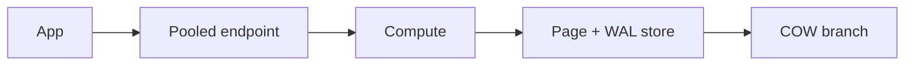

import { ConceptTemplate } from '@/features/kb/components/templates/ConceptTemplate'
import { Callout } from '@/features/kb/components/mdx/Callout'
import { ComparisonTable } from '@/features/kb/components/mdx/ComparisonTable'

export default function Layout({ children }) {
  return (
    <ConceptTemplate title="Neon">
      {children}
    </ConceptTemplate>
  )
}

**Neon** is Postgres with **separated storage and compute**. The pages live in a multi-tenant store; a compute node attaches and speaks the Postgres wire protocol. **Branches** copy-on-write the data for preview apps. Computes can suspend (scale-to-zero) and wake on the next connection.

## 1. Deep Dive and Mechanics

**Compute.** A size you pick (or autosuspend). Cold start is a wake delay — first query after idle is slower. Turn off suspend for latency-critical prod.

**Storage.** WAL and pages on Neon's storage layer, not a local EBS you snapshot by hand. Point-in-time recovery is a product feature.

**Branches.** Create a branch from a parent LSN. Preview environments get isolated data without a full dump. Reset and expire branches or you pay for zombies.

**Extensions and limits.** Most common extensions exist; not every superuser trick. Read the compatibility list before you migrate PostGIS-heavy apps.

<Callout icon="warning" title="Connection storms after wake">
A fleet of serverless functions that each open a new connection will stampede a waking compute. Use a pooled URL (PgBouncer-style) Neon provides.
</Callout>

## 2. Mathematical / Theoretical Foundation

Cost ≈ compute-hours + storage + branches. Scale-to-zero wins for sporadic dev. 24/7 prod often wants a pinned compute — still cheaper than a fat VM if storage stays on Neon.

Copy-on-write branches: first write allocates. A branch that rewrites the whole dataset is not free.

<ComparisonTable
  headers={['Postgres host', 'Compute', 'Trick']}
  rows={[
    ['Neon', 'Detachable', 'Branches + suspend'],
    ['RDS / Cloud SQL', 'Always-on VM', 'Managed engine'],
    ['Supabase', 'Project instance', 'BaaS extras'],
    ['PlanetScale', 'Vitess / PG product', 'Different engine story'],
  ]}
/>

## 3. Real-World Implementation

```bash
# connection string uses -pooler host for serverless clients
psql "$DATABASE_URL"
# create a branch for a PR via API or console, point preview env at it
```

Run migrations against the branch, then promote or rebase as your workflow says.

## 4. Visualizations



## 5. Interview Prep

**Q: How is Neon different from RDS?**
**A:** Storage and compute split, branches, and suspend. RDS is a VM-shaped engine with snapshots.

**Q: When do you not use Neon?**
**A:** Need for exotic extensions, dedicated tenancy, or a compliance boundary Neon cannot sign yet.

**Q: Scale-to-zero vs always-on?**
**A:** Suspend for humans-asleep databases. Always-on for user-facing p99.

## 6. Production Use Cases

- Preview DBs per pull request.
- SaaS that wants Postgres without owning patching.
- Serverless backends that must not hold a 24/7 instance.

<Callout icon="tip" title="Use the pooled endpoint from Functions">
Direct connections plus scale-to-zero plus 100 Lambdas is a wake thundering herd. Pooler exists for that.
</Callout>
