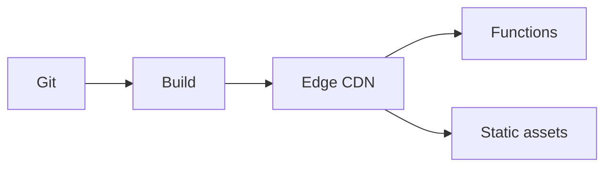

import { ConceptTemplate } from '@/features/kb/components/templates/ConceptTemplate'
import { Callout } from '@/features/kb/components/mdx/Callout'
import { ComparisonTable } from '@/features/kb/components/mdx/ComparisonTable'

export default function Layout({ children }) {
  return (
    <ConceptTemplate title="Netlify">
      {children}
    </ConceptTemplate>
  )
}

**Netlify** pioneered git-push static hosting with a CDN, preview URLs per PR, and **Functions** (and Edge Functions) for server bits. **Netlify Forms**, Identity, and redirects live in `netlify.toml`. It competes with Vercel for frontend teams. It is a bad place to run a long-lived worker JVM.

## 1. Deep Dive and Mechanics

**Build.** Git webhook → build image → publish directory → edge. Build minutes are a quota. Monorepos need ignore and base-directory settings.

**Runtime.** Functions are AWS Lambda-shaped (historically) with Netlify routing. Edge Functions run on Deno-ish isolates. Timeouts apply.

**Redirects and headers.** `_redirects` and `_headers` or toml. SPA fallback and HTTPS are table stakes.

**Split testing and previews.** Deploy previews are the killer feature. Lock them down if the site is private.

<Callout icon="warning" title="Secrets in the build">
Build env vars are available to the build container. A malicious dependency can print them. Scoped tokens, not org-wide PATs.
</Callout>

## 2. Mathematical / Theoretical Foundation

Bandwidth and build minutes dominate cost after the nice free tier. A huge JS bundle plus a crawler is a CDN bill.

Cold starts on Functions are the same FaaS curve. Edge Functions have tighter CPU and different APIs.

<ComparisonTable
  headers={['Need', 'Netlify', 'Vercel']}
  rows={[
    ['Git previews', 'Yes', 'Yes'],
    ['Next.js bias', 'Works', 'Home turf'],
    ['Functions', 'Lambda / Edge', 'Serverless / Edge'],
    ['Enterprise SSO', 'Teams / Enterprise', 'Teams / Enterprise'],
  ]}
/>

## 3. Real-World Implementation

```toml
# netlify.toml
[build]
  command = "npm run build"
  publish = "dist"

[[redirects]]
  from = "/api/*"
  to = "/.netlify/functions/:splat"
  status = 200
```

Pin Node version. "Latest" on the build image is a surprise.

## 4. Visualizations



## 5. Interview Prep

**Q: Netlify vs nginx on a VM?**
**A:** Netlify is CDN + CI + Functions. A VM is cheaper at huge steady bandwidth if you will staff it. Most marketing sites should not staff it.

**Q: Netlify vs Vercel?**
**A:** Similar JAMstack. Framework and team preference dominate. Vercel owns Next.js mindshare.

**Q: Where does the database live?**
**A:** Not on Netlify. Neon, Supabase, PlanetScale, or a hyperscaler. Functions are the glue.

## 6. Production Use Cases

- Marketing and docs sites with PR previews.
- Light APIs as Functions in front of a SaaS DB.
- Split traffic for a landing-page experiment.

<Callout icon="tip" title="Cache HTML on purpose">
If every document is `max-age=0`, you bought a CDN and disabled it. Set cache headers for truly static paths.
</Callout>
