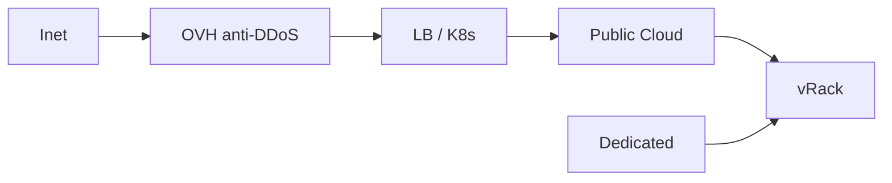

import { ConceptTemplate } from '@/features/kb/components/templates/ConceptTemplate'
import { Callout } from '@/features/kb/components/mdx/Callout'
import { ComparisonTable } from '@/features/kb/components/mdx/ComparisonTable'

export default function Layout({ children }) {
  return (
    <ConceptTemplate title="OVHcloud">
      {children}
    </ConceptTemplate>
  )
}

**OVHcloud** is a large European provider: **Public Cloud** (OpenStack-based instances, block, object), **dedicated servers**, **Hosted Private Cloud** (VMware), and **Managed Kubernetes**. Regions are EU-heavy with some global. The pitch is data sovereignty, predictable pricing, and bare metal. The cost is a smaller managed-service catalog.

## 1. Deep Dive and Mechanics

**Public Cloud.** OpenStack APIs (Nova, Neutron, Swift/S3-compat). Terraform `ovh` and OpenStack providers both appear. Learn which resource lives where.

**Bare metal.** A core OVH product. Hourly/monthly dedicated, not just VMs.

**Networking.** vRacks connect dedicated and public cloud. Anti-DDoS is a historic OVH feature; still configure your own app WAF.

**IAM and projects.** Cloud projects inside an NIC account. Less polished than AWS Organizations; still isolate projects.

<Callout icon="warning" title="OpenStack plus OVH extras">
Some features are OVH APIs, not vanilla OpenStack. Copy-pasting generic OpenStack Terraform can miss vRack or fail on regions.
</Callout>

## 2. Mathematical / Theoretical Foundation

Sovereignty: keeping data in an EU legal entity is a procurement constraint. It does not replace encryption or IAM.

Bare metal vs VM: you buy isolation and NUMA, you own more of the stack (or pay for Private Cloud).

<ComparisonTable
  headers={['Need', 'OVH', 'AWS']}
  rows={[
    ['VM', 'Public Cloud instance', 'EC2'],
    ['Bare metal', 'Dedicated', 'i / metal'],
    ['K8s', 'MKS', 'EKS'],
    ['Object', 'Object Storage', 'S3'],
  ]}
/>

## 3. Real-World Implementation

```bash
openstack server list
# or ovh-cli / terraform ovh_cloud_project_kube
```

Document whether the app is on Public Cloud, dedicated, or vRack-spanning both.

## 4. Visualizations



## 5. Interview Prep

**Q: Why OVH?**
**A:** EU residency, price, dedicated hardware, or existing French/EU ops. Not feature-parity with AWS.

**Q: Public Cloud vs dedicated?**
**A:** Public Cloud is API VMs. Dedicated is servers. vRack can join them.

**Q: Is OpenStack the product?**
**A:** Public Cloud is OpenStack-shaped. Other SKUs are not.

## 6. Production Use Cases

- EU SaaS that must name an EU operator.
- Game/voice workloads on dedicated.
- Kubernetes on MKS with object backups in an EU region.

<Callout icon="tip" title="Test restore across the vRack story">
Backups that cannot restore onto the other side of vRack are theater. Drill it.
</Callout>
