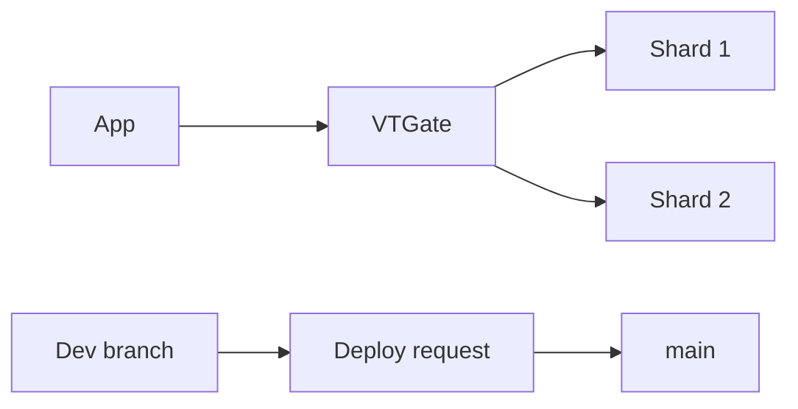

import { ConceptTemplate } from '@/features/kb/components/templates/ConceptTemplate'
import { Callout } from '@/features/kb/components/mdx/Callout'
import { ComparisonTable } from '@/features/kb/components/mdx/ComparisonTable'

export default function Layout({ children }) {
  return (
    <ConceptTemplate title="PlanetScale">
      {children}
    </ConceptTemplate>
  )
}

**PlanetScale** popularized **database branching** and **online schema changes** on a **Vitess** (YouTube-scale MySQL sharding) backbone. You get a MySQL wire protocol, deploy requests for schema, and optional multi-region. A Postgres offering has been part of the roadmap/product mix — treat engine choice as explicit. You do not get SUPER or arbitrary triggers the same way as a pet MySQL.

## 1. Deep Dive and Mechanics

**Branches.** `main` plus development branches. Schema changes are deploy requests, not `ALTER` on prod Friday. Data branching is not a full Neon-style COW of all rows in every plan — read the current branch semantics.

**Vitess.** VTGate routes, VTTablet holds shards. Hot shards and cross-shard joins are your design problem. Foreign keys have historically been limited; check current support.

**Insights.** Query performance and exploding row counts show up in the UI. Missing indexes still hurt.

**Connect.** Serverless driver / pooled connections for edge and Functions.

<Callout icon="warning" title="Not every MySQL feature">
Triggers, some FKs, and SUPER-level tricks may be blocked. App-level integrity is the contract. Design for it.
</Callout>

## 2. Mathematical / Theoretical Foundation

Sharding key choice is forever-ish. A monotonic user-id can hotspot. Hash or entity-id prefixes matter at scale, not at 10 GB.

Online schema change is a copy-and-backfill algorithm (gh-ost / Vitess flavors). Huge tables still take wall time; they just do not block like a naive ALTER.

<ComparisonTable
  headers={['Host', 'Engine', 'Branching']}
  rows={[
    ['PlanetScale', 'Vitess MySQL', 'Schema-first'],
    ['Neon', 'Postgres', 'COW data'],
    ['RDS MySQL', 'MySQL', 'Snapshots'],
    ['Cloud Spanner', 'Spanner SQL', 'No Vitess'],
  ]}
/>

## 3. Real-World Implementation

```bash
pscale branch create db feat-add-index
pscale connect db feat-add-index
# apply migrations, open deploy request to main
```

Never `ALTER` production outside the deploy-request path if you bought the product for that safety.

## 4. Visualizations



## 5. Interview Prep

**Q: Why Vitess?**
**A:** Horizontal MySQL. PlanetScale packages it with a SaaS UX. Interviews want sharding and nonblocking DDL.

**Q: PlanetScale vs RDS?**
**A:** RDS is a managed primary. PlanetScale is a sharded platform with workflow. Small apps may not need it.

**Q: Branching vs dump/restore?**
**A:** Schema workflow is the win. Full data clones depend on plan and product era — do not bluff.

## 6. Production Use Cases

- SaaS MySQL that will outgrow one primary.
- Teams that want reviewable schema deploys.
- Serverless apps that need a pooled MySQL endpoint.

<Callout icon="tip" title="Pick a shard key with a grown-up">
Changing a shard key is a migration project. Start with the access pattern, not with auto-increment pride.
</Callout>
