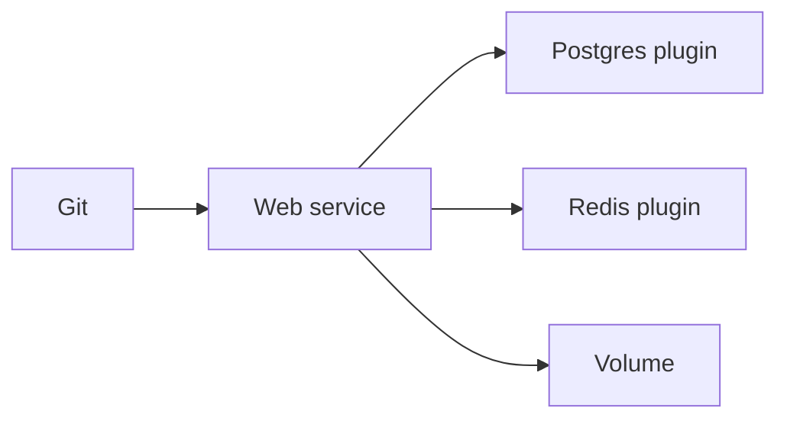

import { ConceptTemplate } from '@/features/kb/components/templates/ConceptTemplate'
import { Callout } from '@/features/kb/components/mdx/Callout'
import { ComparisonTable } from '@/features/kb/components/mdx/ComparisonTable'

export default function Layout({ children }) {
  return (
    <ConceptTemplate title="Railway">
      {children}
    </ConceptTemplate>
  )
}

**Railway** is a modern PaaS: connect a repo, get a **service** with HTTPS, env vars, and optional **volumes**. Multiple services in a **project** share private networking and a plugin marketplace (Postgres, Redis). Usage-based billing. It competes with Render, Fly, and Heroku-shaped DX.

## 1. Deep Dive and Mechanics

**Build.** Dockerfile or Railpack/Nixpacks. The detected start command is a frequent footgun. Pin it.

**Networking.** Public HTTP via a generated domain. Private DNS between services. Do not expose Postgres publicly "for convenience."

**Volumes.** Single-region disks. HA is not automatic because you attached a volume.

**Environments.** PR/ephemeral environments exist depending on plan. Treat them as data-isolated.

<Callout icon="warning" title="Usage surprises">
Idle services, fat images, and chatty logs still bill. Scale-to-zero is not always the default you imagined. Read the metric.
</Callout>

## 2. Mathematical / Theoretical Foundation

Cost ≈ vCPU-RAM-seconds + egress + plugins. A 24/7 service is a small VM in disguise. Compare to a reserved Droplet honestly.

A volume + one replica is RPO/RTO of that replica. Plugin Postgres may have its own HA story — verify.

<ComparisonTable
  headers={['Need', 'Railway', 'Similar']}
  rows={[
    ['Git deploy', 'Service', 'Render / Heroku'],
    ['Private net', 'Project network', 'Compose'],
    ['DB plugin', 'Marketplace', 'Addon'],
    ['Global edge', 'Limited', 'Fly / Cloudflare'],
  ]}
/>

## 3. Real-World Implementation

```dockerfile
FROM node:22-slim
WORKDIR /app
COPY package*.json ./
RUN npm ci --omit=dev
COPY . .
CMD ["node", "server.js"]
```

Set the start command explicitly in the service settings so Railpack does not guess `npm start` wrong.

## 4. Visualizations



## 5. Interview Prep

**Q: Railway vs Kubernetes?**
**A:** Railway hides the cluster. You cannot express complex DaemonSets. Leave when you need that — or when finance wants reserved capacity.

**Q: Railway vs Fly?**
**A:** Fly leans multi-region Machines. Railway leans project UX and plugins. Overlap is large.

**Q: How do you do secrets?**
**A:** Shared variables and sealed env in the project. Not a full Vault. Rotate like any env var.

## 6. Production Use Cases

- Side projects and small SaaS with a web + worker + Postgres.
- Internal tools that should not live on a laptop.
- Prototypes that later move to a hyperscaler with a Dockerfile you already have.

<Callout icon="tip" title="Private Postgres, public app">
The default should be plugin DB on the private network only. Public DB URLs get scanned.
</Callout>
