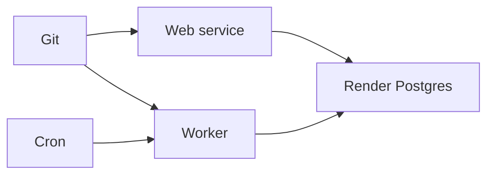

import { ConceptTemplate } from '@/features/kb/components/templates/ConceptTemplate'
import { Callout } from '@/features/kb/components/mdx/Callout'
import { ComparisonTable } from '@/features/kb/components/mdx/ComparisonTable'

export default function Layout({ children }) {
  return (
    <ConceptTemplate title="Render">
      {children}
    </ConceptTemplate>
  )
}

**Render** is a PaaS in the Heroku tradition: **web services**, **background workers**, **cron jobs**, static sites, and **managed Postgres/Redis**. You connect GitHub/GitLab, pick a region, and get HTTPS. Private services and a private network keep workers off the internet. `render.yaml` is Infrastructure-as-blueprint.

## 1. Deep Dive and Mechanics

**Services.** Docker or native buildpacks. Autoscaling on paid plans. Zero-downtime deploys if the health check is honest.

**Datastores.** Render Postgres with PITR on higher tiers. Disks for services that insist on local state — those do not horizontally scale.

**Preview environments.** Spin a stack per PR from `render.yaml`. Cost and data isolation are the reviews you skip at your peril.

**Networking.** Public web vs private worker. Internal URLs for service-to-service.

<Callout icon="warning" title="Health check path">
A `/` that returns 200 only after a 30s warmup will flap deploys. Give Render a cheap `/healthz`.
</Callout>

## 2. Mathematical / Theoretical Foundation

Price is instance-hours plus datastore. A always-on web + worker + PG is comparable to a small VM trio, with less SSH.

Single-region by service. Multi-region is multiple services and a data story you design.

<ComparisonTable
  headers={['Need', 'Render', 'Heroku']}
  rows={[
    ['Web + worker', 'Yes', 'Yes'],
    ['IaC file', 'render.yaml', 'app.json / terraform'],
    ['Private net', 'Yes', 'Spaces / Private'],
    ['Dyno metaphor', 'Service plan', 'Dyno type'],
  ]}
/>

## 3. Real-World Implementation

```yaml
# render.yaml
services:
  - type: web
    name: api
    runtime: docker
    healthCheckPath: /healthz
    envVars:
      - key: DATABASE_URL
        fromDatabase:
          name: pg
          property: connectionString
databases:
  - name: pg
    plan: basic-256mb
```

Commit this. Console-only services drift.

## 4. Visualizations



## 5. Interview Prep

**Q: Render vs Heroku?**
**A:** Same job. Render is often cheaper/clearer for new teams. Heroku has older marketplace gravity.

**Q: Render vs Railway?**
**A:** Overlap. Render's yaml and service types are very Heroku-shaped. Pick on region, DX, and Postgres features.

**Q: When to leave?**
**A:** Custom networking, multi-cloud IAM, or cost at large steady fleets.

## 6. Production Use Cases

- Product APIs with a worker and cron.
- Static + API hybrids.
- Preview stacks for pull requests.

<Callout icon="tip" title="Separate worker from web">
CPU-heavy jobs on the web service steal request latency. A worker service is cheaper than a pager.
</Callout>
