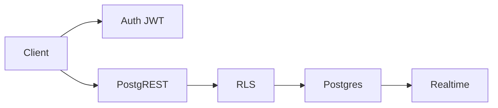

import { ConceptTemplate } from '@/features/kb/components/templates/ConceptTemplate'
import { Callout } from '@/features/kb/components/mdx/Callout'
import { ComparisonTable } from '@/features/kb/components/mdx/ComparisonTable'

export default function Layout({ children }) {
  return (
    <ConceptTemplate title="Supabase">
      {children}
    </ConceptTemplate>
  )
}

**Supabase** wraps **Postgres** with **Auth**, **Storage** (S3-compatible), **Realtime** (WAL → websocket), and **Edge Functions**. Clients can hit PostgREST with a JWT. **Row Level Security (RLS)** is what makes that safe. Self-host is possible; Supabase Cloud is the hosted path.

## 1. Deep Dive and Mechanics

**API.** PostgREST exposes tables and RPCs. Generated types from schema are the DX. Wide tables without RLS are a public SQL endpoint.

**Auth.** GoTrue-style JWT. `auth.uid()` in policies. Service role key bypasses RLS — that key is root.

**Realtime.** Replication slots stream changes. Publication design matters; do not publish every table to every client.

**Storage.** Buckets with policies that also use SQL. Same RLS mindset.

<Callout icon="error" title="Service role in the browser">
The `service_role` secret must never ship to a client. Anon key plus RLS only. Leaking service role is a full database compromise.
</Callout>

## 2. Mathematical / Theoretical Foundation

RLS is a predicate executed per row. A policy that does a slow subquery per row will melt p95. Index the columns policies filter.

Connection count: PostgREST pools, but Edge Functions plus direct Prisma can exhaust Postgres. Use poolers (Supavisor) for serverless.

<ComparisonTable
  headers={['Need', 'Supabase', 'Firebase']}
  rows={[
    ['DB', 'Postgres + RLS', 'Firestore rules'],
    ['Auth', 'GoTrue / JWT', 'Firebase Auth'],
    ['Realtime', 'WAL replication', 'Listeners'],
    ['Escape', 'Any Postgres tool', 'Vendor APIs'],
  ]}
/>

## 3. Real-World Implementation

```sql
ALTER TABLE public.todos ENABLE ROW LEVEL SECURITY;

CREATE POLICY "own rows" ON public.todos
  FOR ALL
  USING (auth.uid() = user_id)
  WITH CHECK (auth.uid() = user_id);
```

Enable RLS **before** you point the anon key at the table.

## 4. Visualizations



## 5. Interview Prep

**Q: Supabase vs Firebase?**
**A:** SQL vs documents. Supabase wins if you want Postgres and SQL tooling. Firebase wins on some mobile offline stories.

**Q: Supabase vs Neon?**
**A:** Neon is Postgres hosting (branches). Supabase is Postgres plus BaaS. You can use both in spirit; usually you pick one DX.

**Q: Is PostgREST safe?**
**A:** Only with RLS and a sane grant to `anon` / `authenticated`. Grants to public without RLS are the incident.

## 6. Production Use Cases

- CRUD SaaS with client-side access and SQL policies.
- Self-hosted stack for teams that want the UX without SaaS.
- Storage + Auth for a small product without rolling custom.

<Callout icon="tip" title="Write policies in migrations">
Console-only RLS will drift. Treat policies like schema: reviewed, versioned, tested.
</Callout>
