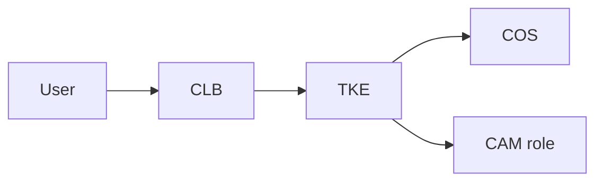

import { ConceptTemplate } from '@/features/kb/components/templates/ConceptTemplate'
import { Callout } from '@/features/kb/components/mdx/Callout'
import { ComparisonTable } from '@/features/kb/components/mdx/ComparisonTable'

export default function Layout({ children }) {
  return (
    <ConceptTemplate title="Tencent Cloud">
      {children}
    </ConceptTemplate>
  )
}

**Tencent Cloud** is a major Chinese hyperscaler. Core IaaS is **CVM** (VMs), **COS** (objects), **VPC**, **CLB**, **TKE** (Kubernetes), **SCF** (functions), and **CAM** (IAM). International regions exist; mainland operations inherit ICP, real-name, and connectivity constraints. Gaming, social, and WeChat-adjacent products often land here for ecosystem reasons.

## 1. Deep Dive and Mechanics

**CAM.** Users, roles, policies. Assume roles for CVM. Same least-privilege story as RAM/IAM with Tencent policy JSON.

**TKE.** Managed Kubernetes with Tencent CNI and CLB integration. Image registry (TCR) belongs in the private network plan.

**COS.** Storage classes and cross-region replication. CDN (Tencent or extra) for public assets.

**Intl vs mainland.** Account, billing, and network are not one global fabric. Plan user geo first.

<Callout icon="warning" title="Ecosystem lock-in">
WeChat login, pay, and mini-programs integrate smoothly and become the architecture. That is a business choice, not a hidden checkbox.
</Callout>

## 2. Mathematical / Theoretical Foundation

Cross-border latency and packet loss make "active-active with AWS us-east-1" a research project. Usually: Tencent for China users, another cloud for the rest, with a data sync you can name.

CAM over-grant is the same math as every cloud: `AdministratorAccess` analogs on a CVM role.

<ComparisonTable
  headers={['Need', 'Tencent', 'Alibaba / AWS']}
  rows={[
    ['VM', 'CVM', 'ECS / EC2'],
    ['Object', 'COS', 'OSS / S3'],
    ['K8s', 'TKE', 'ACK / EKS'],
    ['IAM', 'CAM', 'RAM / IAM'],
  ]}
/>

## 3. Real-World Implementation

```bash
tccli cvm DescribeInstances --Region ap-guangzhou
# Terraform tencentcloud provider: vpc, subnet, cam role, tke cluster
```

Pin regions (`ap-guangzhou` vs `ap-singapore`). Policy documents in git.

## 4. Visualizations



## 5. Interview Prep

**Q: Tencent vs Alibaba?**
**A:** Both are China hyperscalers. Choice is often existing vendor relationship, region capacity, or WeChat vs Alipay ecosystem.

**Q: What is CAM?**
**A:** Tencent IAM. Roles on CVM/TKE, policies on COS.

**Q: Can I treat it like AWS?**
**A:** Skills transfer (VPC, K8s, IAM). Compliance and account structure do not.

## 6. Production Use Cases

- Games and social apps with China users.
- Mini-program backends near WeChat.
- Intl Tencent regions for APAC without mainland ICP.

<Callout icon="tip" title="Separate mainland and intl accounts">
Same advice as Aliyun. Blast radius and filings stay understandable.
</Callout>
