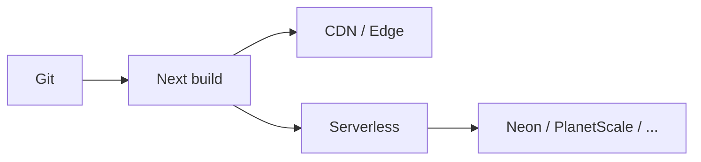

import { ConceptTemplate } from '@/features/kb/components/templates/ConceptTemplate'
import { Callout } from '@/features/kb/components/mdx/Callout'
import { ComparisonTable } from '@/features/kb/components/mdx/ComparisonTable'

export default function Layout({ children }) {
  return (
    <ConceptTemplate title="Vercel">
      {children}
    </ConceptTemplate>
  )
}

**Vercel** is the commercial home of **Next.js**: git-connected projects, preview URLs, a global CDN, and **Serverless** or **Edge** runtimes for server code. **ISR** and cache tags make "static" pages refreshable. Fluid compute and newer runtime names evolve; the idea stays: deploy the UI close to users, keep data in a real database elsewhere.

## 1. Deep Dive and Mechanics

**Build.** Next.js (or other frameworks) compile to static assets plus functions. Build minutes and artifact size are quotas.

**Runtimes.** Node serverless in regions you pick. Edge on isolates with tighter APIs. Choosing Edge does not magically move your Postgres.

**Previews.** Every PR gets a URL. Protect with SSO/password on private products.

**Data cache.** ISR, `revalidate`, and cache tags. Mis-tagged cache serves stale prices. That is a business bug.

<Callout icon="warning" title="Function CPU and payload limits">
A "serverless API" that resizes video will time out. Push heavy work to a queue and a worker on a real machine.
</Callout>

## 2. Mathematical / Theoretical Foundation

Cost ≈ seats + fast-data transfer + function GB-hours. A huge image site on the free bandwidth story becomes a finance meeting.

Cold start vs Edge: Edge reduces some cold starts and forbids some Node APIs. Measure TTFB from more than one region.

<ComparisonTable
  headers={['Need', 'Vercel', 'Netlify']}
  rows={[
    ['Next.js', 'First-class', 'Supported'],
    ['Previews', 'Yes', 'Yes'],
    ['Edge', 'Yes', 'Yes'],
    ['Framework lock', 'Strong Next gravity', 'Broader JAMstack'],
  ]}
/>

## 3. Real-World Implementation

```javascript
// app router sketch: cached fetch with a tag
export default async function Page() {
  const res = await fetch("https://api.example.com/price", {
    next: { tags: ["price"] },
  });
  const data = await res.json();
  return data.amount;
}
```

Revalidate that tag from a webhook when the price changes. Do not hope.

## 4. Visualizations



## 5. Interview Prep

**Q: Is Vercel a cloud?**
**A:** It is a frontend/application platform on top of hyperscalers. You still need a database and often a second place for workers.

**Q: Edge vs Node runtime?**
**A:** Edge: isolates, limited APIs, more PoPs. Node: fuller Node, regional. Match the code, not the buzzword.

**Q: Why do teams leave?**
**A:** Cost at scale, runtime limits, or a need to run the same app in their VPC. Next.js still runs on Docker.

## 6. Production Use Cases

- Marketing and product UIs with PR previews.
- ISR catalogs with tagged revalidation.
- Lightweight BFF routes in front of a core API.

<Callout icon="tip" title="Keep a Docker deploy path">
If the app only builds on Vercel magic, you have lock-in. `next start` in a container is the insurance.
</Callout>
